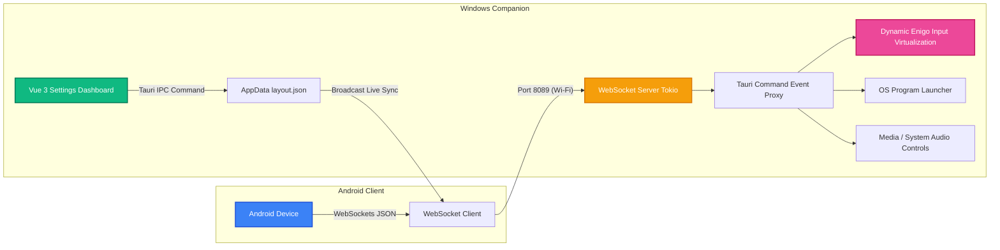

# Android Stream Desk 📱🕹️

Biến thiết bị Android cũ hoặc dư thừa của bạn thành bàn phím macro cảm ứng không dây chuyên nghiệp điều khiển trực tiếp máy tính Windows. Hoạt động hoàn toàn tự lưu trữ (self-hosted) trong mạng Wi-Fi cục bộ (LAN), không yêu cầu Internet, tuyệt đối bảo mật và có độ trễ cực thấp (<30ms).

Giải pháp thay thế mã nguồn mở tiện lợi và dung lượng cực nhẹ cho thiết bị vật lý đắt đỏ như Elgato Stream Deck.

Buy me a coffee: https://ko-fi.com/ania9

---

## 🛠️ Kiến trúc Hệ thống

Hệ thống được phát triển cùng trên **một codebase** bằng công nghệ **Tauri v2** giúp tối thiểu hóa tài nguyên CPU/RAM sử dụng, bao gồm 2 thành phần chính:



1. **Windows Companion (Server)**:
   - Viết bằng Tauri v2 (Backend Rust & Frontend Vue 3 + Tailwind CSS v3).
   - Thiết lập một WebSocket Server chạy ngầm dựa trên Tokio runtime lắng nghe cổng `8089`.
   - Giả lập hệ thống sử dụng thư viện `enigo` (phiên bản bảo mật đa luồng động động) thực thi gõ phím trực tiếp trên OS.
   - Khởi chạy tệp phần mềm `.exe` trực tiếp và điều chỉnh mức âm lượng hoặc nút đa phương tiện (Media play/pause/prev/next).
   - Quản lý và lưu trữ cấu hình mạng lưới lưới nút tại AppData.

2. **Android App (Client)**:
   - Chạy trực tiếp trên máy tính bảng/điện thoại di động Android thông qua Tauri mobile engine.
   - Kết nối tới WebSocket Server máy tính qua địa chỉ IP và Port.
   - Nhận diện bản đồ lưới động (CSS Grid co giãn từ 2x2 đến 6x8) và render giao diện tức thì theo cấu hình trên máy tính.
   - Gửi yêu cầu trigger macro ngược về máy tính khi chạm nút bất kỳ.

---

## ✨ Tính năng nổi bật của MVP

- **Local Network WebSockets**: Kết nối trực tiếp qua LAN, không đi qua cloud. Có heartbeat (Ping/Pong 5s) và cơ chế tự động thử kết nối lại cực nhạy mỗi 3 giây.
- **Bàn phím Lưới Động (CSS Grid)**: Thay đổi hàng và cột động từ Dashboard máy tính, đồng bộ hóa trực tiếp (Live Sync) sang điện thoại ngay tức thì.
- **Giả lập Phím Tắt Hệ Thống**: Hỗ trợ giả lập phím đơn, phím bấm đặc biệt và các tổ hợp tiện ích nâng cao như `Ctrl+Shift+Tab`, `Alt+F4`, `Ctrl+S`, v.v.
- **Bộ Laucher Phần Mềm Nhanh**: Khởi chạy trực tiếp các tệp tin executable `.exe` thông qua đặc quyền User thuần của Windows mà không bị UAC chặn.
- **Bàn Biên Tập Tiện Lợi**: Giao diện Dashboard tùy chọn màu sắc nền của nút, emoji đại diện trực quan cấu hình nhãn chữ nhanh chóng.

---

## 📂 Sơ đồ Thư mục Mã nguồn

```text
android-stream-desk/
├── src-tauri/
│   ├── Cargo.toml            # Dependencies Rust (tungstenite, enigo, serde_json)
│   ├── tauri.conf.json       # Phân quyền cửa sổ desktop + mobile & plugin updater
│   ├── capabilities/
│   │   └── default.json      # ACL cấu hình cho phép shell execute & updater
│   └── src/
│       ├── main.rs           # Launcher entry-point
│       ├── lib.rs            # Rust commands giả lập phím, media, launcher & load/save JSON
│       └── websocket.rs      # Module WebSocket Server Tokio port 8089 & heartbeat
├── src/
│   ├── assets/
│   │   └── tailwind.css      # Cấu hình Tailwind CSS tuỳ biến toàn cục
│   ├── components/
│   │   ├── ConnectionStatus.vue # Biểu diễn trạng thái kết nối & IP input
│   │   ├── GridArea.vue      # Lưới nút co giãn CSS Grid động theo hàng/cột
│   │   └── GridButton.vue    # Macro button (emoji, label, background)
│   ├── stores/
│   │   ├── connection.ts     # Quản lý WebSocket client kết nối & auto-reconnect
│   │   └── layout.ts         # Pinia quản lý lưu trữ, sửa đổi và sync layout
│   ├── views/
│   │   ├── ClientView.vue    # Giao diện chính tương tác trên di động Android
│   │   └── DashboardView.vue # Giao diện biên tập lưới chỉnh sửa trên Windows
│   ├── main.ts               # Setup router & Pinia boostrap
│   └── App.vue               # Switch layout router
├── package.json              # Khai báo pnpm dependencies
└── tailwind.config.ts        # Setup CSS theme mở rộng
```

---

## 📥 Tải về & Cài đặt nhanh

> Không cần tự build — tải thẳng bản dựng sẵn từ [**GitHub Releases**](https://github.com/aniadev/android-stream-desk/releases/latest).

### Windows Companion (máy tính)

1. Vào trang [Releases](https://github.com/aniadev/android-stream-desk/releases) → chọn phiên bản mới nhất.
2. Trong mục **Assets**, tải file:
   - `.msi` — khuyến nghị, trình cài đặt Windows Installer.
   - `_x64-setup.exe` — NSIS installer (nếu không dùng được `.msi`).
3. Chạy file vừa tải, làm theo hướng dẫn cài đặt.
4. Khởi động **Android Stream Desk** — ứng dụng chạy ngầm trong System Tray.

> **Lưu ý tag**: Releases có suffix `-win` (vd: `v1.3.2-win`) chỉ chứa file Windows, không có APK.

### Android Client (điện thoại / máy tính bảng)

1. Vào trang [Releases](https://github.com/aniadev/android-stream-desk/releases) → chọn phiên bản mới nhất.
2. Trong mục **Assets**, tải file `.apk`:
   - `android-stream-desk-vX.Y.Z.apk` — bản đã ký (có keystore).
   - `android-stream-desk-vX.Y.Z-unsigned.apk` — bản chưa ký (fallback).
3. Trên điện thoại: **Cài đặt** → **Bảo mật** → bật **Nguồn không xác định** (hoặc cho phép khi được hỏi).
4. Mở file APK vừa tải để cài đặt.

> **Lưu ý tag**: Releases có suffix `-apk` (vd: `v1.3.2-apk`) chỉ chứa APK, không có file Windows.

---

## 🚀 Hướng dẫn Thiết lập và Cài đặt

### Yêu cầu tiên quyết
- **Node.js**: Phiên bản 18+ kèm trình quản lý gói `pnpm`.
- **Rust**: Cài đặt Rustup (Hỗ trợ cargo check và target compilation).
- **Windows Build Tools**: Cài đặt Visual Studio C++ Build Tools (phục vụ đóng gói Tauri desktop).
- **Android SDK & NDK**: Thiết lập thông qua Android Studio (phục vụ đóng gói sang file `.apk`).

### 1. Khởi chạy Chế độ Phát triển (Dev Mode)

Tải toàn bộ dependencies và chạy ứng dụng máy chủ Companion Windows:
```bash
# 1. Cài đặt Node modules frontend
pnpm install

# 2. Khởi chạy Windows Companion server ở chế độ debug
pnpm tauri dev
```
> Dashboad tùy biến sẽ hiển thị tại `http://localhost:1420/dashboard` hoặc trên cửa sổ Desktop mới mở. Giao diện Client di động thử nghiệm tương thích tại `http://localhost:1420/`.

### 2. Biên dịch và Đóng gói (Build Production)

**Đóng gói Installer Windows (`.msi` / `.exe`)**:
```bash
pnpm tauri build
```
Bộ cài đặt MSI kích thước nhỏ gọn (<10MB) kế thừa từ tối ưu hóa Rust sẽ được sinh ra tại `src-tauri/target/release/bundle/msi/`.

**Đóng gói Cài đặt Android (`.apk`)**:
```bash
pnpm tauri android build
```
File APK cài đặt độc lập sẽ được phân phối tại `src-tauri/gen/android/app/build/outputs/apk/release/app-release.apk`.

---

## 🔒 Quy chuẩn Thiết kế Phi chức năng (NFR)

- **Local Network Isolation**: Ứng dụng **không** gọi bất cứ API nào ra Internet. Mọi giao dịch thông suốt bên trong mạng LAN qua port `8089`.
- **Độ trễ truyền tin lý tưởng**: Độ trễ gửi action từ điện thoại Android và thao tác click phím trên hệ điều hành Windows Companion đạt trung bình từ `15ms` đến `30ms` (qua kết nối mạng chuẩn 5GHz).
- **Hardened Enigo Logic**: Cơ chế tự động giải phóng các phím chức năng Modifier (`Ctrl`, `Alt`, `Shift`, `Win`) sau khi bấm được triển khai chặt chẽ, loại bỏ hoàn toàn khả năng bị kẹt phím nóng hệ thống sau khi click.
