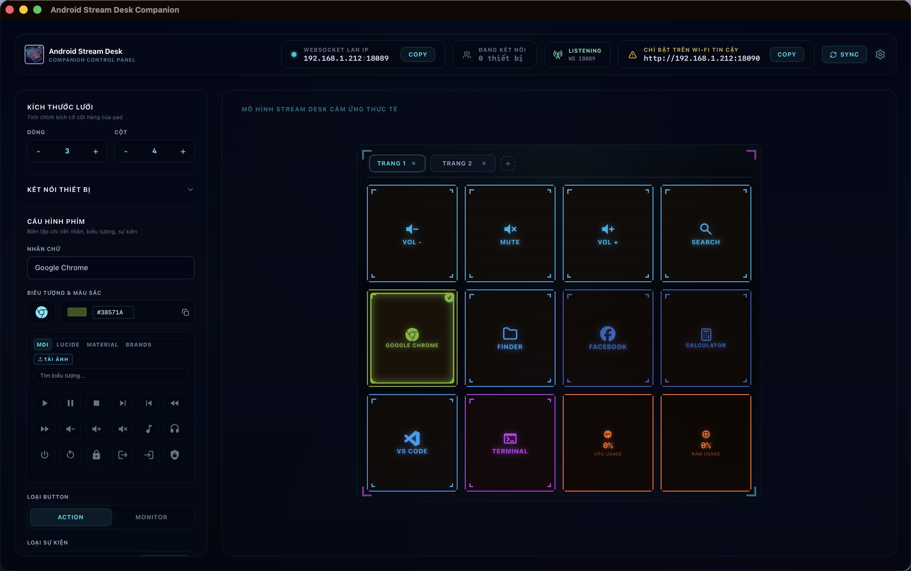
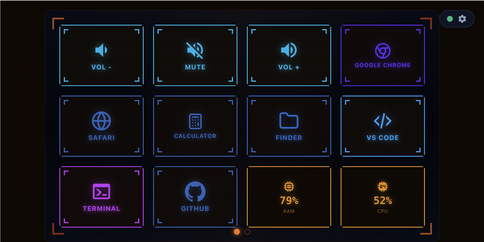
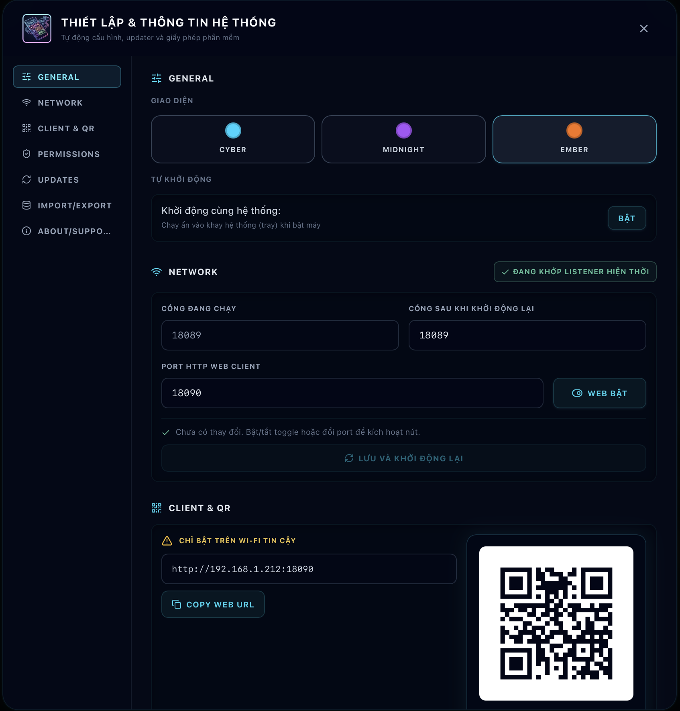
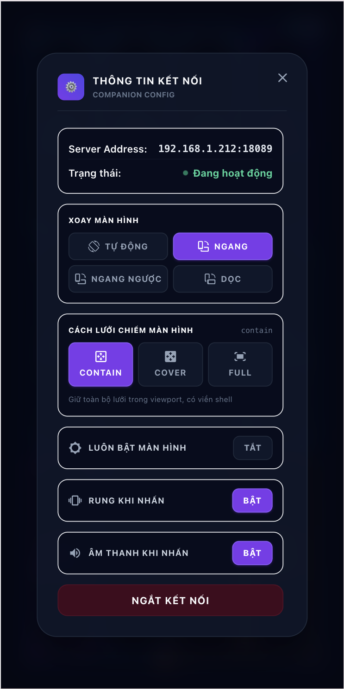
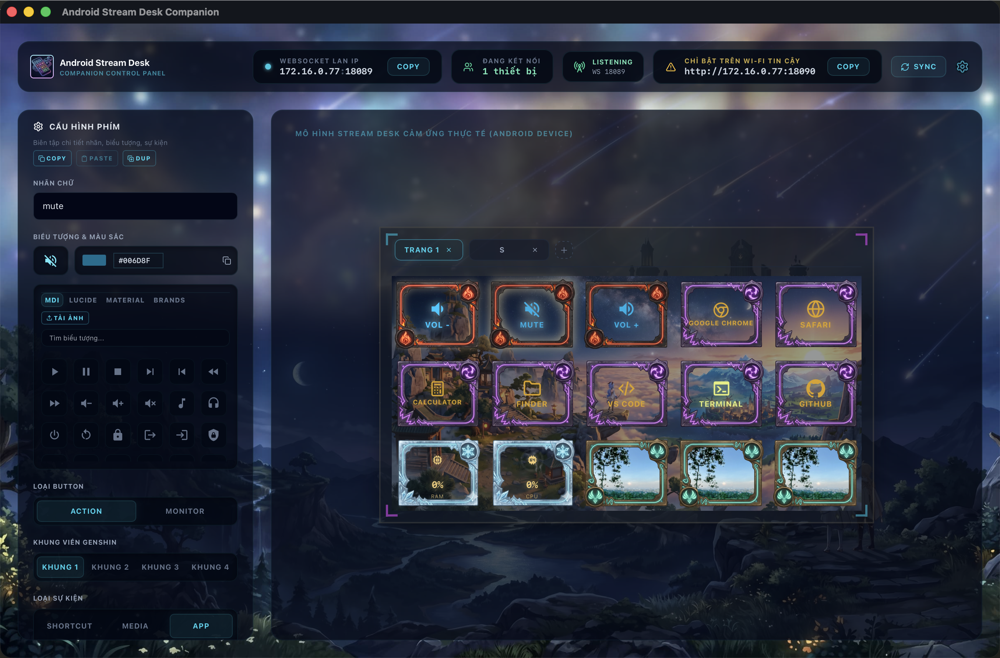
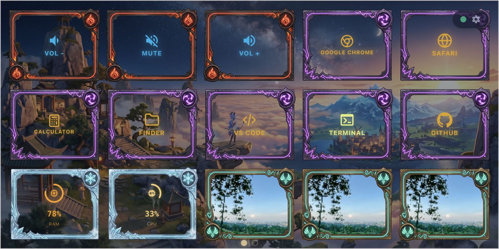
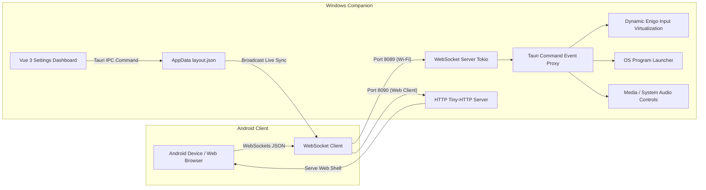

# Android Stream Desk 📱🕹️

Biến thiết bị Android cũ hoặc dư thừa của bạn thành bàn phím macro cảm ứng không dây chuyên nghiệp điều khiển trực tiếp máy tính Windows. Hoạt động hoàn toàn tự lưu trữ (self-hosted) trong mạng Wi-Fi cục bộ (LAN), không yêu cầu Internet, tuyệt đối bảo mật và có độ trễ cực thấp (<30ms).

Giải pháp thay thế mã nguồn mở tiện lợi và dung lượng cực nhẹ cho thiết bị vật lý đắt đỏ như Elgato Stream Deck.

Buy me a coffee: https://ko-fi.com/ania9

---

### 📸 Ảnh Chụp Giao Diện (Screenshots)

| Giao diện Companion Dashboard | Giao diện Android/Web Client |
| :---: | :---: |
|  |  |
| **Cấu hình Cài đặt (Companion)** | **Cài đặt & Xoay màn hình (Client)** |
|  |  |
| **Đồng bộ Theme Genshin (Companion)** | **Đồng bộ Theme Genshin (Client)** |
|  |  |

---

## 🛠️ Kiến trúc Hệ thống

Hệ thống được phát triển cùng trên **một codebase** bằng công nghệ **Tauri v2** giúp tối thiểu hóa tài nguyên CPU/RAM sử dụng, bao gồm 2 thành phần chính:



1. **Windows Companion (Server)**:
   - Viết bằng Tauri v2 (Backend Rust & Frontend Vue 3 + Tailwind CSS v3).
   - Thiết lập một WebSocket Server chạy ngầm dựa trên Tokio runtime lắng nghe cổng `8089`.
   - Giả lập hệ thống sử dụng thư viện `enigo` (phiên bản bảo mật đa luồng động động) thực thi gõ phím trực tiếp trên OS.
   - Khởi chạy tệp phần mềm `.exe` trực tiếp và điều chỉnh mức âm lượng hoặc nút đa phương tiện (Media play/pause/prev/next).
   - Quản lý và lưu trữ cấu hình mạng lưới lưới nút tại AppData.

2. **Android App (Client)**:
   - Chạy trực tiếp trên máy tính bảng/điện thoại di động Android thông qua Tauri mobile engine.
   - Kết nối tới WebSocket Server máy tính qua địa chỉ IP và Port.
   - Nhận diện bản đồ lưới động (CSS Grid co giãn từ 2x2 đến 6x8) và render giao diện tức thì theo cấu hình trên máy tính.
   - Gửi yêu cầu trigger macro ngược về máy tính khi chạm nút bất kỳ.

---

## ✨ Tính năng nổi bật của MVP

- **Local Network WebSockets**: Kết nối trực tiếp qua LAN, không đi qua cloud. Có heartbeat (Ping/Pong 5s) và cơ chế tự động thử kết nối lại cực nhạy mỗi 3 giây.
- **Bàn phím Lưới Động (CSS Grid)**: Thay đổi hàng và cột động từ Dashboard máy tính, đồng bộ hóa trực tiếp (Live Sync) sang điện thoại ngay tức thì.
- **Giả lập Phím Tắt Hệ Thống**: Hỗ trợ giả lập phím đơn, phím bấm đặc biệt và các tổ hợp tiện ích nâng cao như `Ctrl+Shift+Tab`, `Alt+F4`, `Ctrl+S`, v.v.
- **Bộ Laucher Phần Mềm Nhanh**: Khởi chạy trực tiếp các tệp tin executable `.exe` thông qua đặc quyền User thuần của Windows mà không bị UAC chặn.
- **Bàn Biên Tập Tiện Lợi**: Giao diện Dashboard tùy chọn màu sắc nền của nút, emoji đại diện trực quan cấu hình nhãn chữ nhanh chóng.

---

## 📂 Sơ đồ Thư mục Mã nguồn

```text
android-stream-desk/
├── src-tauri/
│   ├── Cargo.toml            # Dependencies Rust (tungstenite, enigo, serde_json)
│   ├── tauri.conf.json       # Phân quyền cửa sổ desktop + mobile & plugin updater
│   ├── capabilities/
│   │   └── default.json      # ACL cấu hình cho phép shell execute & updater
│   └── src/
│       ├── main.rs           # Launcher entry-point
│       ├── lib.rs            # Rust commands giả lập phím, media, launcher & load/save JSON
│       └── websocket.rs      # Module WebSocket Server Tokio port 8089 & heartbeat
├── src/
│   ├── assets/
│   │   └── tailwind.css      # Cấu hình Tailwind CSS tuỳ biến toàn cục
│   ├── components/
│   │   ├── ConnectionStatus.vue # Biểu diễn trạng thái kết nối & IP input
│   │   ├── GridArea.vue      # Lưới nút co giãn CSS Grid động theo hàng/cột
│   │   └── GridButton.vue    # Macro button (emoji, label, background)
│   ├── stores/
│   │   ├── connection.ts     # Quản lý WebSocket client kết nối & auto-reconnect
│   │   └── layout.ts         # Pinia quản lý lưu trữ, sửa đổi và sync layout
│   ├── views/
│   │   ├── ClientView.vue    # Giao diện chính tương tác trên di động Android
│   │   └── DashboardView.vue # Giao diện biên tập lưới chỉnh sửa trên Windows
│   ├── main.ts               # Setup router & Pinia boostrap
│   └── App.vue               # Switch layout router
├── package.json              # Khai báo pnpm dependencies
└── tailwind.config.ts        # Setup CSS theme mở rộng
```

---

## 📥 Tải về & Cài đặt nhanh

> Không cần tự build — tải thẳng bản dựng sẵn từ [**GitHub Releases**](https://github.com/aniadev/android-stream-desk/releases/latest).

### Windows Companion (máy tính)

1. Vào trang [Releases](https://github.com/aniadev/android-stream-desk/releases) → chọn phiên bản mới nhất.
2. Trong mục **Assets**, tải file:
   - `.msi` — khuyến nghị, trình cài đặt Windows Installer.
   - `_x64-setup.exe` — NSIS installer (nếu không dùng được `.msi`).
3. Chạy file vừa tải, làm theo hướng dẫn cài đặt.
4. Khởi động **Android Stream Desk** — ứng dụng chạy ngầm trong System Tray.

> **Lưu ý tag**: Releases có suffix `-win` (vd: `v1.3.2-win`) chỉ chứa file Windows, không có APK.

### macOS Companion (máy tính)

Do bản phát hành macOS là **chưa đăng ký bản quyền Apple (unsigned)**, vui lòng làm theo các bước sau để khởi chạy:

1. Vào trang [Releases](https://github.com/aniadev/android-stream-desk/releases) tải file `.dmg` mới nhất.
2. Mở file `.dmg` và kéo ứng dụng vào thư mục `Applications`.
3. Nhấp đúp mở ứng dụng. Hệ thống (Gatekeeper) sẽ hiển thị thông báo chặn app từ nhà phát triển không xác định.
4. **Vượt Gatekeeper**:
   - Truy cập **System Settings → Privacy & Security**, kéo xuống dưới cùng tìm mục app bị chặn và chọn **Open Anyway** (Vẫn mở).
   - *Cách 2 (qua Terminal)*: Chạy lệnh sau rồi mở lại app bình thường:
     ```bash
     xattr -dr com.apple.quarantine "/Applications/Android Stream Desk.app"
     ```
5. **Cấp quyền phím macro**: Đi tới **System Settings → Privacy & Security → Accessibility**, tích chọn bật cho phép **Android Stream Desk** phát tín hiệu click mô phỏng phím hệ thống.

> **Lưu ý tag**: Releases có suffix `-mac` (vd: `v1.4.0-mac`) chỉ chứa bản build macOS.

### Linux Companion (máy tính)

Ứng dụng hỗ trợ chạy trực tiếp thông qua tệp gói `.deb` hoặc đóng gói di động `.AppImage`.

1. Vào trang [Releases](https://github.com/aniadev/android-stream-desk/releases) tải tệp `.deb` hoặc `.AppImage`.
2. **Cài đặt tệp `.deb`**:
   ```bash
   sudo dpkg -i <ten_file>.deb
   sudo apt-get install -f # Tự động vá các gói dependency bị thiếu (nếu có)
   ```
3. **Chạy tệp `.AppImage`**:
   ```bash
   chmod +x <ten_file>.AppImage
   ./<ten_file>.AppImage
   ```
4. **Các thư viện hệ thống cần thiết (Runtime dependencies)**:
   Gói chạy yêu cầu các thư viện hệ thống tối thiểu:
   `libwebkit2gtk-4.1-dev`, `libgtk-3-dev`, `libxdo-dev`, `libappindicator3-dev`, `librsvg2-dev`.

> **Lưu ý về Wayland (Caveat)**: Thư viện giả lập phím thô `enigo` hoạt động hiệu quả nhất trên kiến trúc đồ họa Windowing **X11**. Trên môi trường **Wayland thuần**, các thao tác nhấn giữ phím nóng hệ thống có thể bị hạn chế. Khuyến nghị chuyển phiên đăng nhập OS sang chế độ **X11** để đạt hiệu năng giả lập phím tốt nhất.

> **Lưu ý tag**: Releases có suffix `-linux` (vd: `v1.4.0-linux`) chỉ chứa bản build Linux.

### Android Client (điện thoại / máy tính bảng)

1. Vào trang [Releases](https://github.com/aniadev/android-stream-desk/releases) → chọn phiên bản mới nhất.
2. Từ v1.5.1, APK được **tách riêng theo kiến trúc CPU (ABI)** để mỗi file nhẹ hơn nhiều so với bản universal cũ (~33MB thay vì ~131MB). Trong mục **Assets**, chọn đúng file cho máy:
   - `android-stream-desk-vX.Y.Z-arm64.apk` — **arm64-v8a (64-bit)**. Chọn file này cho hầu hết điện thoại đời 2015 trở lại đây.
   - `android-stream-desk-vX.Y.Z-arm.apk` — **armeabi-v7a (32-bit)**. Chỉ dành cho máy cũ/giá rẻ chạy chip 32-bit.
   - Suffix `-unsigned` (vd: `...-arm64-unsigned.apk`) là bản chưa ký (fallback khi release không có keystore).
3. Trên điện thoại: **Cài đặt** → **Bảo mật** → bật **Nguồn không xác định** (hoặc cho phép khi được hỏi).
4. Mở file APK vừa tải để cài đặt.

#### Chọn ABI nào cho máy của bạn?

> **Quy tắc nhanh**: gần như mọi máy hiện nay đều dùng **`-arm64`**. Chỉ tải `-arm` nếu máy quá cũ hoặc đã thử `-arm64` báo không cài được.

| ABI | File | Dòng máy ví dụ |
| :--- | :--- | :--- |
| `arm64-v8a` (64-bit) | `-arm64.apk` | Samsung Galaxy S8/S10/S20/S21/S23/S24, A52/A54; Xiaomi Redmi Note 8/9/10/11/12, POCO; Google Pixel (tất cả); OPPO/Realme/Vivo đời mới; OnePlus; Galaxy Tab S6/S7/S8/S9 |
| `armeabi-v7a` (32-bit) | `-arm.apk` | Samsung Galaxy S4/S5, J1/J2/Grand Prime; máy Android Go giá rẻ rất cũ; tablet đời 2014 trở về trước |

> Không chắc máy 32-bit hay 64-bit? Cài app **CPU-Z** (hoặc xem **Cài đặt → Giới thiệu điện thoại**) để kiểm tra; hoặc cứ thử `-arm64` trước — nếu hệ thống báo "ứng dụng không tương thích" thì mới chuyển sang `-arm`.

> **Lưu ý tag**: Releases có suffix `-apk` (vd: `v1.3.2-apk`) chỉ chứa APK, không có file Windows.

---

## 🚀 Hướng dẫn Thiết lập và Cài đặt

### Yêu cầu tiên quyết
- **Node.js**: Phiên bản 18+ kèm trình quản lý gói `pnpm`.
- **Rust**: Cài đặt Rustup (Hỗ trợ cargo check và target compilation).
- **Windows Build Tools**: Cài đặt Visual Studio C++ Build Tools (phục vụ đóng gói Tauri desktop).
- **Android SDK & NDK**: Thiết lập thông qua Android Studio (phục vụ đóng gói sang file `.apk`).

### 1. Khởi chạy Chế độ Phát triển (Dev Mode)

Tải toàn bộ dependencies và chạy ứng dụng máy chủ Companion Windows:
```bash
# 1. Cài đặt Node modules frontend
pnpm install

# 2. Khởi chạy Windows Companion server ở chế độ debug
pnpm tauri dev
```
> Dashboad tùy biến sẽ hiển thị tại `http://localhost:1420/dashboard` hoặc trên cửa sổ Desktop mới mở. Giao diện Client di động thử nghiệm tương thích tại `http://localhost:1420/`.

### 2. Biên dịch và Đóng gói (Build Production)

**Đóng gói Installer Windows (`.msi` / `.exe`)**:
```bash
pnpm tauri build
```
Bộ cài đặt MSI kích thước nhỏ gọn (<10MB) kế thừa từ tối ưu hóa Rust sẽ được sinh ra tại `src-tauri/target/release/bundle/msi/`.

**Đóng gói Cài đặt Android (`.apk`)**:
```bash
pnpm android:build
```
Lệnh này tách APK theo từng ABI và chỉ build cho điện thoại thật (`arm64-v8a` + `armeabi-v7a`, bỏ `x86`/`x86_64` chỉ dùng cho emulator). File ra tại:
```text
src-tauri/gen/android/app/build/outputs/apk/arm64/release/android-stream-desk-vX.Y.Z-arm64.apk   # arm64-v8a
src-tauri/gen/android/app/build/outputs/apk/arm/release/android-stream-desk-vX.Y.Z-arm.apk       # armeabi-v7a
```

Build riêng một ABI cho nhanh (khuyến nghị khi test, đa số máy đời mới dùng arm64):
```bash
pnpm android:build:arm64    # chỉ arm64-v8a
```

Tự chọn target thủ công nếu cần ABI khác (tên target ngắn theo `tauri android build`: `aarch64`, `armv7`, `i686`, `x86_64`):
```bash
pnpm tauri android build --apk --split-per-abi \
  --target aarch64 \      # arm64-v8a (64-bit)
  --target armv7          # armeabi-v7a (32-bit)
```

> **Vì sao tách ABI?** Bản universal cũ gói cả 4 ABI vào một APK ~131MB vì frontend bị nhúng vào mỗi `.so` per-ABI. Tách theo ABI và bỏ x86/x86_64 đưa mỗi APK về ~33MB; chỉ tải đúng file cho máy mình.

---

## 🔒 Quy chuẩn Thiết kế Phi chức năng (NFR)

- **Local Network Isolation**: Ứng dụng **không** gọi bất cứ API nào ra Internet. Mọi giao dịch thông suốt bên trong mạng LAN qua port `8089`.
- **Độ trễ truyền tin lý tưởng**: Độ trễ gửi action từ điện thoại Android và thao tác click phím trên hệ điều hành Windows Companion đạt trung bình từ `15ms` đến `30ms` (qua kết nối mạng chuẩn 5GHz).
- **Hardened Enigo Logic**: Cơ chế tự động giải phóng các phím chức năng Modifier (`Ctrl`, `Alt`, `Shift`, `Win`) sau khi bấm được triển khai chặt chẽ, loại bỏ hoàn toàn khả năng bị kẹt phím nóng hệ thống sau khi click.
