# v1.4.0 Feature Breakdown

Đợt cập nhật v1.4.0 mở rộng năng lực tổ chức và tương thích đa nền tảng: bổ sung **multi-page** (nhiều trang button + carousel chuyển trang), nâng cấp **bộ ghi tổ hợp phím** (chord 3 phím đồng thời, xử lý combo bị OS chặn như Win+Shift+S, hỗ trợ PrintScreen), **upload icon tùy biến** (png/jpg từ máy), **bản build macOS + Linux** kèm hướng dẫn, **cải thiện UX reconnect Client** (rớt giữa session → reconnect ngầm, không bật modal/lỗi), **tự khởi động cùng Windows**, và **sound + vibration khi nhấn** trên Client. Kèm theo một spike **nghiên cứu kết nối qua cáp USB** và 3 bug fix: chọn đường dẫn khi export, lỗi drag-drop chết sau khi export, và lỗi dán shortcut app đã copy vào ô đường dẫn.

> **Ghi chú phạm vi:** Phần kết nối USB là **research/feasibility spike**, không phải implementation. macOS Companion đã được hỗ trợ ở tầng code (enigo + Accessibility prompt đã có); v1.4.0 chỉ bổ sung **build pipeline + tài liệu**. Linux là nền tảng mới hoàn toàn ở tầng build.

---

## 1. FEATURE 1: Multi Page — Nhiều trang button + điều hướng

### 1.1 Phân tích gốc rễ / Technical Analysis

* `Layout` hiện là cấu trúc **phẳng**, một lưới duy nhất: `{ rows, cols, buttons[], theme? }` (`src/types/index.ts:28-33`). Rust `Layout` struct trong `src-tauri/src/lib.rs` mirror cấu trúc này.
* `GridArea.vue` render trực tiếp `layoutStore.layout.buttons` qua directive `v-draggable="[layoutStore.layout.buttons, {...}]"` — không có khái niệm trang.
* Stream Deck vật lý thường có nhiều **page/profile**. Người dùng nhiều macro nhanh chóng chạm trần lưới (mặc định 3×3 = 9 ô; trần hiện tại 6×8 = 48 ô — `updateGridDimensions` clamp `rows∈[2,6]`, `cols∈[2,8]` tại `DashboardView.vue:477-478`). Không có cách nhóm macro theo ngữ cảnh (gaming / streaming / dev).
* Ràng buộc kỹ thuật cần giữ: directive `v-draggable` của `vue-draggable-plus` bám **tham chiếu mảng** `buttons` đã bind lúc mount. `resizeGrid` (`src/stores/layout.ts:141-146`) cố tình dùng `splice` thay vì reassign để giữ tham chiếu — nếu không Sortable mất con trỏ mảng và button "snap back" sau khi thả. Multi-page phải tôn trọng pattern này khi đổi trang.
* Metrics loop (monitor button, từ v1.3.0 S-MON3) đọc `layout.json` để tìm các button `buttonKind == "monitor"` tính `min_interval_ms`. Khi có nhiều trang, loop phải quét button **trên tất cả các trang**, không chỉ trang đang xem.

### 1.2 Giải pháp & Bản thiết kế

**Mô hình dữ liệu (backward-compatible):**
* Thêm interface `Page` và field `pages` vào `Layout`:
  ```ts
  export interface Page { id: string; name?: string; buttons: ButtonConfig[]; }
  export interface Layout {
    rows: number; cols: number;
    pages: Page[];
    buttons?: ButtonConfig[]; // legacy — giữ để migrate, không dùng sau migration
    theme?: string;
  }
  ```
* `rows`/`cols` **dùng chung** cho mọi trang (một thân máy, nhiều trang). Đơn giản hóa render + giữ tương thích layout cũ.
* **Migration:** layout cũ chỉ có `buttons[]` → `sanitizeLayout` bọc thành `pages: [{ id: 'page_1', buttons }]` và xóa field `buttons` top-level. Layout mới luôn ghi `pages`. Đọc cả hai dạng (graceful).

**Điều hướng — TÁCH Client vs Dashboard để tránh xung đột gesture (CHỐT):**
* Xác nhận codebase: `GridArea.vue` (có `v-draggable`) **chỉ dùng ở Client** (`ClientView.vue:179`). `DashboardView.vue` có **grid editor riêng** với draggable riêng (`:1344`). Hai view tách biệt.
* **Client** (`GridArea.vue`): dùng **shadcn Carousel** (`embla-carousel-vue`) — vuốt ngang + dot pagination. **DISABLE `v-draggable`** trên Client (controller chỉ tap, không cần reorder) → swipe sạch, không đụng Sortable.
* **Dashboard** (editor): GIỮ Sortable drag-reorder; chuyển trang bằng **pagination dạng tabs/dot CLICK** (không swipe, không carousel) → không tranh chấp gesture.
* → embla (swipe, chỉ Client) và vue-draggable-plus (drag, chỉ Dashboard) **không bao giờ chạy cùng vùng** ⇒ hết xung đột.
* Carousel **CHƯA cài** — cần `npx shadcn-vue add carousel` (kéo theo dep `embla-carousel-vue`). Hiện `src/components/ui/` chỉ có `Button.vue`/`Card.vue`/`Input.vue`. Ẩn chrome điều hướng khi `pages.length <= 1`.
* **Trạng thái trang cục bộ từng client**, KHÔNG broadcast: Client A xem trang 2 không ép Client B. `currentPageIndex` runtime trong store, không nằm `layout.json`, không gửi WS.

**Đồng bộ:**
* Không cần WS message type mới. Khi Dashboard sửa cấu hình (thêm/xóa/đổi tên trang, sửa button) → `save_layout_config` ghi cả `pages` → `broadcast_layout_to_clients` gửi full layout (gồm `pages`) → Client cập nhật danh sách trang. Cơ chế `sync_layout` hiện có là đủ.
* Rust `Layout` struct: thêm `pages: Option<Vec<Page>>` + struct `Page { id, name: Option<String>, buttons: Vec<ButtonConfig> }` với `#[serde(rename_all = "camelCase")]`. Giữ `buttons: Option<Vec<ButtonConfig>>` để đọc layout cũ.
* Metrics loop: cập nhật bước quét monitor button → flatten tất cả `pages[].buttons`.

### 1.3 Stories

#### S-PAGE1 — Types + migration + Rust struct + metrics scan
* **Goal:** Mô hình `pages` đầy đủ ở TS + Rust; layout cũ tự migrate; metrics loop quét monitor button trên mọi trang.
* **Scope:**
  - `src/types/index.ts`: thêm `Page`, đổi `Layout.buttons` → `pages: Page[]` (giữ `buttons?` legacy).
  - `src/stores/layout.ts`: trong block đọc `localStorage` (`:114-128`) và handler `sync_layout` (`:184-194`) — viết `migrateLayout()`: nếu có `buttons[]` mà không có `pages` → bọc thành `pages: [{ id, buttons }]`. Áp dụng backfill `buttonKind` cho button trong mọi trang.
  - `src-tauri/src/lib.rs`: thêm struct `Page`, field `pages: Option<Vec<Page>>` vào `Layout`; `save_layout_config` ghi `pages`.
  - Metrics loop (S-MON3 cũ): đổi bước tìm monitor button sang flatten `pages`.
  - `default_layout` (TS + Rust): bọc bộ button mặc định vào `pages: [{ id: 'page_1', buttons }]`.
* **Complexity:** Trung bình

#### S-PAGE2 — Layout store: page state + CRUD + draggable an toàn
* **Goal:** Store quản lý trang hiện tại + thêm/xóa/đổi tên/điều hướng, giữ tham chiếu mảng cho Sortable.
* **Scope:**
  - `src/stores/layout.ts`: thêm `currentPageIndex = ref(0)`, computed `currentPage`, `currentButtons`.
  - Actions: `addPage()`, `removePage(idx)` (chặn xóa trang cuối cùng), `renamePage(idx, name)`, `goNextPage()`, `goPrevPage()`.
  - **Quan trọng (giữ pattern Sortable):** khi đổi trang, **không reassign** mảng button mà draggable đang bind. Hai lựa chọn: (a) directive bind vào `currentButtons` computed → key lại GridArea theo `currentPageIndex` để remount Sortable mỗi lần đổi trang (đơn giản, chấp nhận remount nhẹ); (b) splice in-place mảng đang bind bằng nội dung trang mới. **Khuyến nghị (a)** — thêm `:key="currentPageIndex"` lên container draggable; remount sạch, tránh con trỏ mảng lệch trang.
  - `reorderButtons`/`onUpdate` thao tác trên `currentPage.buttons` thay vì `layout.buttons`.
* **Complexity:** Cao (rủi ro nhất là tương tác với vue-draggable-plus)

#### S-PAGE3 — Client (GridArea): shadcn Carousel + dot pagination
* **Goal:** Client Android chuyển trang bằng carousel (vuốt) + dot pagination; không reorder.
* **Scope:**
  - Cài shadcn Carousel: `npx shadcn-vue add carousel` → `src/components/ui/Carousel*.vue` + dep `embla-carousel-vue`.
  - `GridArea.vue`: **bỏ/disable `v-draggable`** (Client là controller, không reorder) → swipe sạch. Bọc các trang trong Carousel, mỗi slide render lưới `page.buttons`.
  - Dot pagination dưới carousel (active = trang hiện tại, tap nhảy trang); sync embla API (`scrollTo`, `selectedScrollSnap`, `on('select')`) ↔ `currentPageIndex`. Ẩn khi `pages.length <= 1`.
  - Style dot theo theme (`var(--accent)`).
* **Complexity:** Trung bình (xung đột gesture đã loại bằng cách disable draggable trên Client)

#### S-PAGE4 — Dashboard: page tabs (CLICK) + add/remove/rename, giữ Sortable
* **Goal:** Editor tạo/xóa/đổi tên/chuyển trang bằng CLICK (không swipe), giữ drag-reorder.
* **Scope:**
  - `DashboardView.vue`: dải **page tabs/dot CLICK** phía trên grid editor (`:1344`): click tab chuyển trang, `+` thêm, `×`/menu xóa/đổi tên. **KHÔNG dùng carousel/swipe ở Dashboard** → Sortable drag-reorder (`:1344-1354`) hoạt động bình thường.
  - Thêm trang mới: khởi tạo đủ `rows×cols` ô mặc định (tái dùng logic `updateGridDimensions`, `:484-497`).
  - Đổi `rows`/`cols` áp cho **mọi trang** (cập nhật `resizeGrid` map qua tất cả `pages`).
  - Xóa trang đang chọn → chuyển `currentPageIndex` về trang hợp lệ gần nhất.
* **Complexity:** Trung bình

---

## 2. FEATURE 2: Nâng cấp Record tổ hợp phím

### 2.1 Phân tích gốc rễ / Technical Analysis

Ba vấn đề riêng biệt, gốc rễ khác nhau:

**(a) Combo 3 phím (vd Alt+P+W) — không hỗ trợ end-to-end:**
* Frontend `handleKeyDown` (`DashboardView.vue:264-300`) bắt các modifier + **đúng một** base key (`keyName`), build chuỗi `[...modifiers, keyName].join('+')`. Định dạng chỉ chứa **một** phím không-modifier → không biểu diễn được hai base key.
* Rust `parse_shortcut` (`src-tauri/src/lib.rs:445-475`) **chủ động từ chối** nhiều base key: trả `Err("Shortcut '{}' has multiple base keys")` (`:461-464`). `simulate_shortcut` (`:507-537`) chỉ Press các modifier → Click **một** base key → Release modifier.
* → `Alt+P+W` bất khả thi ở cả frontend lẫn backend. **Ngữ nghĩa (CHỐT): nhấn ĐỒNG THỜI** — giữ Alt + P + W cùng lúc, rồi nhả. Không phải chuỗi tuần tự.

**(b) Combo bị OS chặn (Win+Shift+S, Win+S, …) — không record được:**
* Các combo này bị **OS chặn ở tầng hệ thống** (Win+Shift+S → Snipping Tool). Sự kiện keydown **không bao giờ tới WebView**, nên `handleKeyDown` không bao giờ chạy → live-record thất bại.
* Đã có sẵn workaround: toggle modifier thủ công + ô nhập key + nút **"Áp dụng"** (`applyManualKey`, `DashboardView.vue:304-313`; comment `:302-303` ghi rõ "required for OS-trapped combos that never reach JS"). Nhưng UX chưa nổi bật/khó phát hiện.
* Lưu ý: việc **thực thi** Win+Shift+S vẫn hoạt động (enigo gửi được — nó là button mặc định trong `defaultLayout`, `src/stores/layout.ts:43`). Vấn đề **chỉ ở khâu record**.

**(c) PrintScreen — không record và không thực thi được:**
* Record: `e.key === 'PrintScreen'`, nhưng trên Windows phím PrtSc thường chỉ phát sự kiện trên **keyup**, không phải keydown → listener keydown của `handleKeyDown` không bắt được.
* Parse: `parse_key` (`src-tauri/src/lib.rs:411-441`) **không có** mapping "printscreen" → trả `None` (độ dài > 1, không khớp match) → `parse_shortcut` báo `"Unrecognized key token"`. Nên kể cả nhập tay "PrintScreen" cũng fail khi thực thi.

### 2.2 Giải pháp & Bản thiết kế

**Grammar shortcut mới (đa base key, CHORD đồng thời):**
* `parse_shortcut` đổi kiểu trả về `(Vec<Key> modifiers, Vec<Key> bases)` — `bases` có thể >1.
* `simulate_shortcut`: Press modifiers → **Press (giữ) tất cả base key** trong `bases` → **Release base key theo thứ tự ngược** → Release modifiers ngược. Tức tất cả phím giữ đồng thời rồi nhả (chord, không phải click tuần tự). Giữ nguyên pattern đối xứng release-on-failure (`:517-534`) cho cả base key — nếu Press phím thứ k fail, release các phím đã giữ trước đó theo thứ tự ngược rồi mới bail.
* Thêm mapping PrintScreen vào `parse_key`: `"printscreen" | "prtsc" | "print" => Key::Print` (enigo `Key::Print`).

**Frontend record chord + PrintScreen:**
* `handleKeyDown`: thay vì chốt ngay khi gặp base key đầu tiên, theo dõi **tập phím đang giữ đồng thời** (`heldKeys: Set<string>`) — keydown thêm phím, keyup bắt đầu chốt. Snapshot tổ hợp lớn nhất giữ cùng lúc → build chuỗi `[...modifiers, ...heldBases].join('+')` (vd `Alt+P+W`). Chốt khi phím đầu tiên được nhả (chord hoàn tất).
* Lắng nghe cả `keyup` cho PrintScreen (vì keydown thường không phát trên Windows): nếu `e.key === 'PrintScreen'` ở keyup → ghi nhận.

**UX cho combo bị OS chặn (tái dùng manual entry):**
* Mở rộng dropdown preset shortcut (`DashboardView.vue:53-` quanh `applyPreset`) thêm nhóm "Phím hệ thống (không record được)": Win+Shift+S, Win+S, Win+L, PrintScreen, Alt+PrintScreen…
* Làm rõ khối manual: thêm chú thích "Combo bị Windows chặn? Bật modifier + chọn phím rồi bấm Áp dụng".

### 2.3 Stories

#### S-REC1 — Rust: chord đa base key + PrintScreen
* **Goal:** Backend parse + thực thi chord nhiều phím giữ đồng thời; nhận PrintScreen.
* **Scope:**
  - `parse_shortcut` (`src-tauri/src/lib.rs:445-475`): bỏ nhánh lỗi "multiple base keys"; trả `(Vec<Key>, Vec<Key>)`.
  - `simulate_shortcut` (`:507-537`): Press modifiers → Press giữ tất cả base key → Release base key ngược → Release modifiers ngược. Đối xứng release-on-failure cho cả base key.
  - `parse_key` (`:411-441`): thêm `"printscreen" | "prtsc" | "print" => Some(Key::Print)`.
  - **Test:** `Alt+P+W` → giữ Alt+P+W đồng thời → nhả W,P,Alt. `PrintScreen` → click Key::Print.
* **Complexity:** Trung bình

#### S-REC2 — Frontend: record chord đồng thời + bắt PrintScreen keyup
* **Goal:** Record được Alt+P+W (đồng thời) và PrintScreen từ bàn phím.
* **Scope:**
  - `DashboardView.vue` `handleKeyDown` (`:264-300`): theo dõi `heldKeys: Set<string>` (keydown thêm, keyup chốt); snapshot tổ hợp lớn nhất khi phím đầu được nhả thay vì chốt phím đầu tiên.
  - Đăng ký thêm `keyup` listener trong `toggleRecording` (`:317-327`) cho chord-finalize + PrintScreen; remove cùng chỗ với keydown (gồm `onUnmounted`, `:329-330`).
  - Preview chuỗi đang giữ (vd "Alt + P + …") realtime.
* **Complexity:** Trung bình

#### S-REC3 — UX preset cho combo bị OS chặn
* **Goal:** Người dùng gán nhanh Win+Shift+S / PrintScreen mà không cần record.
* **Scope:**
  - Bổ sung danh sách preset nhóm "phím hệ thống" gần `applyPreset` (`:232-237`).
  - Thêm chú thích hướng dẫn ở khối manual entry (quanh `:1122-1181`).
* **Complexity:** Thấp

---

## 3. RESEARCH 3: Kết nối qua cáp USB — Feasibility Spike

### 3.1 Phân tích gốc rễ / Technical Analysis

* Client Android kết nối qua `ws://<lan-ip>:8089` (`src/stores/connection.ts`: `ipAddress`/`port`, mặc định port `8089`). Yêu cầu cùng mạng LAN — bất tiện ở môi trường không Wi-Fi hoặc Wi-Fi cách ly client (AP isolation).
* Yêu cầu: kết nối qua cáp USB. Đây là **spike nghiên cứu**, không implement trong v1.4.0.

### 3.2 Các hướng & đánh giá (deliverable của spike)

| Hướng | Cơ chế | Ưu | Nhược |
| :--- | :--- | :--- | :--- |
| **ADB reverse** | `adb reverse tcp:8089 tcp:8089` → `localhost:8089` trên phone forward sang PC qua USB. Client connect `127.0.0.1:8089`. | Không đổi giao thức; chỉ cần "USB mode" dùng 127.0.0.1 | Cần ADB trên PC + bật USB debugging/developer mode trên phone |
| **USB tethering (RNDIS)** | Phone chia sẻ mạng qua USB → PC có IP tether; dùng đúng code LAN hiện có | Không cần dev mode; không sửa app | User phải bật USB tethering thủ công; IP thay đổi |
| **AOA / raw USB** | Transport USB native (Android Open Accessory) | Không cần LAN/ADB | Rất nặng; WebView/Tauri không thao tác raw USB dễ dàng — **không khuyến nghị** |

* **Khuyến nghị sơ bộ:** tài liệu hóa hướng **ADB reverse** (kèm script helper `adb reverse` + toggle "Kết nối USB" đặt IP = `127.0.0.1`) là khả thi nhất với thay đổi code tối thiểu. USB tethering là fallback không cần code.

### 3.3 Stories

#### S-USB1 — Spike feasibility + tài liệu khuyến nghị
* **Goal:** Báo cáo khả thi + PoC tối thiểu (ADB reverse → Client connect 127.0.0.1) + khuyến nghị go/no-go cho version sau.
* **Scope:**
  - Thử nghiệm `adb reverse tcp:8089 tcp:8089` với thiết bị thật; xác nhận Client connect `127.0.0.1:8089`.
  - Ghi `_bmad-output/planning-artifacts/research-usb-connection.md`: các hướng, rào cản (dev mode, driver, ADB), khuyến nghị.
  - **Không** sửa code production trong v1.4.0 (trừ PoC throwaway).
* **Complexity:** Trung bình (research, không phải code production)

---

## 4. FEATURE 4: Build macOS + Linux kèm hướng dẫn

### 4.1 Phân tích gốc rễ / Technical Analysis

* `tauri.conf.json` đặt `"targets": "all"` (`:7`) nhưng CI chỉ build **Windows + Android** (`.github/workflows/release.yml`: job `build-windows` + `build-android`; không có macOS/Linux).
* macOS Companion **đã được hỗ trợ ở tầng code**: enigo có nhánh macOS, `enigo_init_err` (`src-tauri/src/lib.rs:477-490`) đã hướng dẫn Accessibility permission, `defaultLayout` có nhánh `isMac`. Thiếu là **build pipeline + .dmg + tài liệu cài**.
* Linux: nền tảng **mới hoàn toàn**. enigo cần X11/libxdo; `tauri build` cần các gói hệ thống (`libwebkit2gtk-4.1-dev`, `libgtk-3-dev`, `libxdo-dev`, `libappindicator3-dev`, `librsvg2-dev`). Lưu ý **Wayland**: enigo hỗ trợ hạn chế trên Wayland — cần ghi rõ caveat (khuyến nghị phiên X11).
* `update-manifest` job hiện chỉ điền platform `windows-x86_64` (`release.yml:254-266`).

### 4.2 Giải pháp & Bản thiết kế

* Thêm job `build-macos` (`runs-on: macos-latest`): build target `aarch64-apple-darwin` + `x86_64-apple-darwin` (hoặc `universal-apple-darwin`), bundle `dmg`/`app`. **CHỐT: bundle UNSIGNED** (không có Apple Developer cert) + hướng dẫn user bỏ qua Gatekeeper (`xattr -dr com.apple.quarantine /Applications/...app` hoặc System Settings → Privacy & Security → "Open Anyway").
* Thêm job `build-linux` (`runs-on: ubuntu-latest`): cài system deps qua `apt`, bundle `deb` + `appimage`.
* Tag conventions: mở rộng suffix — `-mac`, `-linux`; full `v*` build cả 4 (Win/Android/macOS/Linux). Cập nhật block "Set build flags from tag suffix" (`release.yml:33-46`).
* Tài liệu cài đặt (README): macOS (.dmg → kéo vào Applications → cấp Accessibility); Linux (.deb/.AppImage → cài → lưu ý X11/xdotool, caveat Wayland).
* (Tùy chọn) mở rộng `update-manifest` thêm platform `darwin-aarch64`/`darwin-x86_64`/`linux-x86_64`.

### 4.3 Stories

#### S-BUILD1 — release.yml: job build macOS (.dmg)
* **Goal:** Tag release sinh artifact macOS .dmg/.app tự động.
* **Scope:**
  - Thêm job `build-macos` vào `release.yml`: setup pnpm/Node/Rust (targets apple-darwin), `tauri-action` với `--bundles dmg`.
  - Thêm flag `build_macos` vào `create-release` outputs + logic suffix tag (`-mac`).
  - Bundle **unsigned** (không cert); hướng dẫn Gatekeeper trong README (làm ở S-BUILD3).
* **Complexity:** Trung bình

#### S-BUILD2 — release.yml: job build Linux (.deb/.AppImage)
* **Goal:** Tag release sinh artifact Linux .deb + .AppImage.
* **Scope:**
  - Thêm job `build-linux`: step `apt-get install` các gói (`libwebkit2gtk-4.1-dev libgtk-3-dev libxdo-dev libappindicator3-dev librsvg2-dev`), `tauri-action --bundles deb,appimage`.
  - Thêm flag `build_linux` + suffix tag (`-linux`).
  - Verify enigo compile được trên Linux (X11). Nếu lỗi feature flag → ghi vào AGENTS.md.
* **Complexity:** Cao (nền tảng mới, rủi ro deps/enigo cao nhất đợt này)

#### S-BUILD3 — Tài liệu cài đặt + tag conventions + (tùy chọn) updater manifest
* **Goal:** README có hướng dẫn cài macOS/Linux; convention tag rõ ràng.
* **Scope:**
  - README: mục cài macOS (Accessibility) + Linux (deps, caveat Wayland).
  - Cập nhật comment tag conventions đầu `release.yml` (`:3-6`).
  - (Tùy chọn) mở rộng `update-manifest` map platform darwin/linux.
* **Complexity:** Thấp

---

## 5. FEATURE 5: Upload icon tùy biến (png/jpg) từ máy

### 5.1 Phân tích gốc rễ / Technical Analysis

* `ButtonConfig.icon` là **chuỗi tên iconify** (vd `"mdi:play"`, `src/types/index.ts:12`). `GridButton.vue` + icon picker render qua `<Icon :icon="..." />` của `@iconify/vue`. Không có đường nào để dùng ảnh do user cung cấp.
* Hệ quả: user không gắn được logo/ảnh riêng (game art, brand chưa có trong simple-icons…).

### 5.2 Giải pháp & Bản thiết kế

* **Lưu dưới dạng data URI** trong chính field `icon`: `data:image/png;base64,…`. Render branch: nếu `icon.startsWith('data:')` → render ``, ngược lại `<Icon>`.
* **Bắt buộc downscale + nén** lúc upload (vì `layout.json` + mọi WS `sync_layout` broadcast toàn bộ layout — base64 lớn sẽ phình payload): dùng `<canvas>` resize về ~96×96px, export `image/webp` hoặc `image/png` chất lượng vừa, cap ~10–20KB/icon. Cảnh báo nếu vượt ngưỡng.
* Lý do chọn data URI thay vì lưu file qua Rust: Client (Android) **không** truy cập filesystem của Companion; Client chỉ nhận layout qua WS. Data URI đi kèm layout → hiển thị được trên cả Companion lẫn Client mà **không cần transport mới**. (Lưu file + HTTP endpoint sẽ phức tạp hơn nhiều cho ít lợi ích.)
* Sanitize/import: cho phép `icon` dạng `data:image/(png|jpeg|webp);base64,…`; từ chối scheme khác (an toàn — không cho `javascript:`/`http:` để tránh SSRF/XSS).

### 5.3 Stories

#### S-IMG1 — Upload + downscale pipeline + render branch
* **Goal:** User chọn ảnh png/jpg → tự resize/nén → lưu data URI → hiển thị trên button (Companion + Client).
* **Scope:**
  - Icon picker (`DashboardView.vue`): thêm tab/nút "Tải ảnh lên" với `<input type="file" accept="image/png,image/jpeg">`.
  - Pipeline: `FileReader` → load vào `Image` → vẽ lên `<canvas>` 96×96 (giữ tỉ lệ, letterbox) → `canvas.toDataURL('image/webp', 0.8)` → set `selectedButton.icon = dataURL` → `saveButtonSettings()`. Cảnh báo nếu kích thước data URI > ~20KB.
  - `GridButton.vue` + grid render: `v-if="button.icon.startsWith('data:')"` → ``, else `<Icon>`.
  - `sanitizeLayout` (`src/stores/layout.ts`) + `importLayout` (`:255-274`): chấp nhận `data:image/...` cho `icon`; chặn scheme khác.
* **Complexity:** Trung bình

---

## 6. BUG FIX 6a+6b: Export — chọn đường dẫn & lỗi drag-drop sau export

### 6.1 Phân tích gốc rễ / Technical Analysis

**Cùng một gốc rễ:** `exportLayout` (`src/stores/layout.ts:231-243`) dùng hack download của browser — tạo `Blob`, `<a download>`, `appendChild(a)` → `a.click()` → `removeChild(a)`.

* **Bug 6a (không chọn được path):** `a.download` đẩy file về thư mục Downloads mặc định, không có hộp thoại chọn nơi lưu.
* **Bug 6b (drag-drop chết sau export):** Giả thuyết gốc — chèn `<a>` rồi `a.click()` kích hoạt download trong WebView làm **gián đoạn trạng thái pointer/listener** mà `vue-draggable-plus` (Sortable) bám vào. Sortable đăng ký listener pointer/touch/drag toàn cục; cú click download lập trình + thao tác DOM append/remove + đổi focus có thể để Sortable ở trạng thái drag treo → thả button không ăn. (Lưu ý: cơ chế chính xác **cần xác nhận lúc runtime**; nhưng thiết kế thay thế bên dưới loại bỏ hoàn toàn nguyên nhân nghi vấn.)

### 6.2 Giải pháp & Bản thiết kế

* Thay hack DOM-anchor bằng **save dialog native của Tauri** khi ở context desktop:
  - Thêm `@tauri-apps/plugin-dialog` + `@tauri-apps/plugin-fs` (Cargo.toml + `capabilities/default.json`).
  - `exportLayout`: nếu `window.__TAURI_INTERNALS__` → `save({ defaultPath, filters: [{ name: 'JSON', extensions: ['json'] }] })` → `writeTextFile(path, json)`. Nếu không (web) → giữ fallback blob hiện tại.
* Loại bỏ việc chèn `<a>` ở desktop → **đồng thời** sửa 6a (có path picker) **và** 6b (không còn DOM mutation phá Sortable).

### 6.3 Stories

#### S-EXP1 — Export native qua Tauri dialog + fs
* **Goal:** Export mở hộp thoại chọn đường dẫn; drag-drop vẫn hoạt động sau export.
* **Scope:**
  - Thêm plugin `dialog` + `fs` vào `src-tauri/Cargo.toml`, register trong `run()`, thêm quyền vào `capabilities/default.json` (`dialog:allow-save`, `fs:allow-write-text-file`).
  - `src/stores/layout.ts` `exportLayout`: nhánh Tauri dùng `save()` + `writeTextFile()`; nhánh web giữ blob.
  - **Verify thủ công:** sau khi export thành công ở desktop → kéo-thả button trong editor vẫn ăn (regression test cho 6b).
* **Complexity:** Trung bình

---

## 7. BUG FIX 6c + App Launcher: Đường dẫn & khởi chạy app

### 7.1 Phân tích gốc rễ / Technical Analysis

* Khi user **copy một shortcut ứng dụng** trên Windows (chuột phải Chrome ở Start Menu/Desktop/Explorer → Copy), clipboard chứa **tham chiếu file** (định dạng `CF_HDROP` / file-drop), **không phải text**.
* Handler `handleAppPathPaste` (`src/views/DashboardView.vue:120-147`) chỉ đọc `e.clipboardData?.getData('text')`. Với clipboard dạng file-drop, `getData('text')` trả chuỗi rỗng hoặc tên hiển thị ("Google Chrome"), **không** phải đường dẫn `.lnk`.
* → Nhánh `.lnk` (`:126`) không kích hoạt, nhánh strip-quote (`:142`) cũng không → paste **không làm gì** = "không hoạt động".
* Kể cả đọc `clipboardData.files[0]` cũng chỉ cho tên + nội dung file, **không** cho đường dẫn tuyệt đối (WebView ẩn path thật vì lý do bảo mật) → không truyền được vào `resolve_shortcut` (`src-tauri/src/lib.rs:304-335`, vốn nhận đường dẫn `.lnk` tuyệt đối).

### 7.2 Giải pháp & Bản thiết kế

* Thêm Tauri command Rust đọc **file-drop list từ clipboard native** (cho đường dẫn tuyệt đối):
  - Windows: đọc `CF_HDROP` (crate `clipboard-win`, hoặc PowerShell `Get-Clipboard -Format FileDropList`).
  - macOS: `NSPasteboard` file URLs (nếu hỗ trợ macOS).
* `handleAppPathPaste`: nếu `getData('text')` không có path khả dụng → `invoke('read_clipboard_files')` → lấy phần tử đầu là `.lnk`/`.exe` → nếu `.lnk` thì `resolve_shortcut` (tái dùng), set `appPath`.
* **Bổ sung khuyến nghị (giảm phụ thuộc clipboard):** nhấn mạnh **App Picker** (`AppPickerModal.vue`, đọc app cài đặt từ registry — đã tồn tại) là đường chính, ổn định nhất. (Tùy chọn) hỗ trợ **drag-drop file** `.lnk`/`.exe` vào ô (Tauri file-drop event cho path tuyệt đối).

### 7.3 Stories

#### S-PASTE1 — Rust clipboard file-drop reader + wire vào paste handler
* **Goal:** Copy shortcut Chrome ở Windows → dán vào ô App path → resolve ra .exe đúng.
* **Scope:**
  - `src-tauri/src/lib.rs`: thêm command `read_clipboard_files() -> Result<Vec<String>, String>` (Windows CF_HDROP; trả `Err` không hỗ trợ trên nền khác). Đăng ký trong `invoke_handler`. Thêm quyền capability nếu cần.
  - `DashboardView.vue` `handleAppPathPaste` (`:120-147`): khi text rỗng/không có path → fallback `read_clipboard_files()` → resolve `.lnk` qua `resolve_shortcut` đã có.
  - Hint UX: nếu vẫn fail → gợi ý dùng App Picker.
* **Complexity:** Trung bình

### 7.4 Phân tích bổ sung: App cần launcher/args (vd League of Legends)

* `list_installed_apps_windows` (`src-tauri/src/lib.rs:158-248`) đọc `DisplayIcon`/`InstallLocation` từ registry Uninstall → resolve ra **một `.exe` trần**, KHÔNG kèm launcher + args.
* App/game hiện đại cần chạy qua launcher với flag: vd **League of Legends** = `RiotClientServices.exe --launch-product=league_of_legends --launch-patchline=live`. Chạy thẳng `LeagueClient.exe` từ registry sẽ lỗi/không vào game.
* Lệnh chạy đúng nằm trong **shortcut Start Menu** (`.lnk` có `TargetPath` + `Arguments`). `resolve_shortcut` (`:304-335`) đã trích cả args (`"$t $a"`, `:316`) và `parse_exe_and_args` (`:561`) đã tách `.exe` + args ⇒ `appPath` HOÀN TOÀN có thể chứa args; vấn đề chỉ là **nguồn dữ liệu** (registry không có args).
* **Giải pháp:** App Picker quét thêm **shortcut Start Menu** (`%ProgramData%\Microsoft\Windows\Start Menu\Programs` + `%AppData%\Microsoft\Windows\Start Menu\Programs`) — `.lnk` mang launcher + args đúng — thay vì chỉ registry. Fallback: dán shortcut (S-PASTE1) hoặc dùng action `command`.

#### S-APP1 — App Picker quét Start Menu shortcuts (hỗ trợ launcher/args)
* **Goal:** Chọn được app cần launcher (LoL…) với lệnh chạy đúng (launcher + args).
* **Scope:**
  - `src-tauri/src/lib.rs`: enumerate `.lnk` trong Start Menu (ProgramData + AppData), resolve qua `resolve_shortcut` → `InstalledApp.path` mang `target + args`.
  - Merge với danh sách registry (dedupe theo target exe; **ưu tiên entry có args**).
  - `AppPickerModal.vue`: chọn app → `appPath` = full command (gồm args).
  - **Verify:** chọn League of Legends → `appPath` = `RiotClientServices.exe --launch-product=league_of_legends --launch-patchline=live` → launch vào game đúng.
* **Complexity:** Trung bình

---

## 8. FEATURE 6: UX Client — Reconnect ngầm khi mất kết nối

### 8.1 Phân tích gốc rễ / Technical Analysis

* Khi Companion (PC) tắt sau khi đã kết nối: heartbeat chết sau 5s (`connection.ts:181-203`) → `status='disconnected'` → `triggerAutoReconnect` thử lại **3 lần × 3s** (`MAX_RECONNECT_ATTEMPTS=3`, `:6`, `:212-234`) → hết lượt → `status='error'` (`:214`, `:225-227`).
* `ClientView.vue` hiển thị **modal connect to** mỗi khi không `connected` (grid `v-if status==='connected'` `:176`; nếu không thì hiện modal/banner). Sau 3 lần fail → block lỗi "Không kết nối được sau N lần thử" (`:225-236`).
* → Mất session đang chạy bật lại **full modal + thông báo lỗi** dù user chỉ rớt mạng tạm thời. UX kém — không phân biệt "chưa từng kết nối" với "đang chạy thì rớt".

### 8.2 Giải pháp & Bản thiết kế

* Thêm flag `hasConnectedOnce` (set `true` trong `ws.onopen`, `:109-116`) để phân biệt 2 trạng thái:
  - **Chưa từng connect** (`!hasConnectedOnce`) **HOẶC chủ động disconnect** (`userDisconnected`, `:162-173`) → hiện modal connect (giữ hành vi cũ: thử 3×3s rồi báo lỗi nếu lần đầu fail).
  - **Đã connect rồi mà rớt** (`hasConnectedOnce && !userDisconnected`) → **KHÔNG hiện modal, KHÔNG set `error`**; giữ grid (layout cache) hiển thị, chỉ đổi **status icon**, auto-reconnect **mỗi 30s, không giới hạn lượt**, chạy ngầm.
* `triggerAutoReconnect` (`:212-234`): hai chế độ — nếu `hasConnectedOnce` → interval `30000ms`, bỏ cap `MAX_RECONNECT_ATTEMPTS`, không chuyển `status='error'`; ngược lại giữ logic 3×3s hiện tại.
* `ClientView.vue` gate modal: `showConnectModal = (!hasConnectedOnce && status !== 'connected') || userDisconnected`. Khi `hasConnectedOnce && !connected && !userDisconnected` → vẫn render grid (cache) + **status icon "đang kết nối lại"** (mở rộng HUD pill `:340-342` thêm biến thể disconnected/reconnecting).

### 8.3 Stories

#### S-CONN1 — Client reconnect ngầm + gate modal theo trạng thái
* **Goal:** Modal chỉ hiện lần đầu hoặc khi chủ động ngắt; rớt giữa session → reconnect ngầm 30s + đổi status icon.
* **Scope:**
  - `connection.ts`: thêm `hasConnectedOnce` (set trong `ws.onopen`); `triggerAutoReconnect` hai chế độ (30s/unlimited khi đã từng connect, không set `error`); export `hasConnectedOnce`.
  - `ClientView.vue`: tính `showConnectModal` theo `hasConnectedOnce`/`userDisconnected`; giữ grid + status icon khi reconnect ngầm; ẩn block lỗi "sau N lần thử" trong chế độ ngầm.
  - HUD pill (`:340-342`): thêm biến thể trạng thái (connected / reconnecting / disconnected) với màu icon khác nhau.
  - **Test:** connect thành công → tắt Companion → grid vẫn hiện, icon đổi sang "reconnecting", không có modal/lỗi → bật lại Companion trong vòng 30s → auto reconnect.
* **Complexity:** Trung bình (frontend-only)

---

## 9. FEATURE 7: Tự động khởi động cùng Windows (Companion)

### 9.1 Phân tích gốc rễ / Technical Analysis

* Companion là server LAN — user muốn nó chạy sẵn khi bật máy để Client kết nối ngay, không phải mở app thủ công.
* Hiện KHÔNG có cơ chế autostart: không có entry registry Run, không plugin (`grep autostart` trong Cargo/package/src → none).
* Window close hiện hide-to-tray (`lib.rs:739-746`), tray "Thoát" mới thực thoát → app phù hợp chạy nền sau khi autostart.

### 9.2 Giải pháp & Bản thiết kế

* Dùng **`tauri-plugin-autostart`** (hỗ trợ Windows/macOS/Linux). Trên Windows ghi registry `HKCU\...\Run`. Đăng ký với arg `--hidden` (hoặc tự xử lý) để khởi động vào tray, không bật cửa sổ.
* Settings toggle trong Dashboard: "Khởi động cùng Windows" → gọi `enable()`/`disable()` qua JS `@tauri-apps/plugin-autostart`; đọc trạng thái thực qua `isEnabled()`.
* Desktop-only (gate `#[cfg(desktop)]`). Persist ở tầng OS (plugin tự lo), UI chỉ phản ánh `isEnabled()`.

### 9.3 Stories

#### S-AUTO1 — Autostart plugin + Dashboard toggle
* **Goal:** Bật/tắt "khởi động cùng Windows"; bật → app tự chạy (vào tray) khi đăng nhập Windows.
* **Scope:**
  - `src-tauri/Cargo.toml`: thêm `tauri-plugin-autostart = "2"`.
  - `package.json`: thêm `@tauri-apps/plugin-autostart`.
  - `src-tauri/src/lib.rs` `run()`: `#[cfg(desktop)] builder = builder.plugin(tauri_plugin_autostart::init(MacosLauncher::LaunchAgent, Some(vec!["--hidden"])));`.
  - `capabilities/default.json`: thêm `"autostart:default"`.
  - `DashboardView.vue`: trong settings modal (`settingsOpen`), thêm toggle "Khởi động cùng Windows" → `import('@tauri-apps/plugin-autostart')` → `enable()`/`disable()`; `onMounted` đọc `isEnabled()` set trạng thái toggle.
  - Khởi động `--hidden` → vào tray (window đã hide-to-tray sẵn).
* **Complexity:** Thấp

---

## 10. FEATURE 8: Sound + Vibration khi nhấn (Android Client)

### 10.1 Phân tích gốc rễ / Technical Analysis

* Client là macro pad cảm ứng — không có phản hồi xúc giác/âm thanh khi tap → user không chắc đã nhấn trúng button (đặc biệt khi không nhìn màn hình).
* `GridButton.handleClick` (`src/components/GridButton.vue:61-62`) chỉ `emit('press')`. `GridArea.handlePress` (Client-only component, `GridArea.vue`) gọi `pressButton`. Không có haptic/audio feedback.
* Settings store đã có (`src/stores/settings.ts`) với pattern `keepScreenOn` + persist `localStorage` key `settings:*` — dễ mở rộng.

### 10.2 Giải pháp & Bản thiết kế

* **Vibration:** Web Vibration API `navigator.vibrate(ms)` — hoạt động trong Android WebView. Guard `'vibrate' in navigator` (desktop/không hỗ trợ → bỏ qua). Rung ngắn ~15-30ms.
* **Sound:** click sound ngắn qua **Web Audio API** (`AudioContext` + short buffer/oscillator) — tránh phụ thuộc file lớn; hoặc bundle 1 file âm thanh nhỏ phát qua `new Audio()`. **Lưu ý autoplay:** AudioContext bị suspend tới khi có user-gesture → `resume()` ở lần tap đầu.
* **Toggle settings:** thêm `soundOnClick`, `vibrateOnClick` vào settings store (cùng pattern `keepScreenOn`). UI toggle trong overlay settings của ClientView (cạnh "Luôn bật màn hình").
* **Điểm fire:** trong `GridArea.handlePress` (Client-only) — fire sound + vibration TRƯỚC `pressButton`, guard theo settings. Không fire ở Dashboard (GridButton editor click = select, khác path).

### 10.3 Stories

#### S-FB1 — Settings toggles + Vibration feedback
* **Goal:** Tap button trên Client rung nhẹ; bật/tắt được trong settings.
* **Scope:**
  - `src/stores/settings.ts`: thêm `vibrateOnClick` + `soundOnClick` (ref + watch persist `settings:vibrateOnClick` / `settings:soundOnClick`, default `true`).
  - `ClientView.vue`: trong overlay settings, thêm 2 toggle "Rung khi nhấn" + "Âm thanh khi nhấn".
  - `GridArea.vue` `handlePress`: nếu `settings.vibrateOnClick && 'vibrate' in navigator` → `navigator.vibrate(20)` trước `pressButton`.
* **Complexity:** Thấp

#### S-FB2 — Click sound feedback
* **Goal:** Tap button phát click sound ngắn; bật/tắt trong settings; không lỗi autoplay.
* **Scope:**
  - `src/lib/clicksound.ts` (NEW): module quản lý `AudioContext` (lazy init), `playClick()` (oscillator/buffer ngắn ~40ms), `unlockAudio()` (resume context ở user-gesture đầu).
  - `ClientView.vue` `onMounted`: gắn one-shot listener unlock audio ở lần touch đầu.
  - `GridArea.vue` `handlePress`: nếu `settings.soundOnClick` → `playClick()`.
  - Fallback: Web Audio không hỗ trợ → no-op, không crash.
* **Complexity:** Thấp

---

## 11. Tổng hợp & Kế hoạch Triển khai v1.4.0

### Dependency Graph

```mermaid
graph TD
    %% Multi-page
    S-PAGE1[S-PAGE1 Types + migration + Rust + metrics] --> S-PAGE2[S-PAGE2 Store page state + CRUD]
    S-PAGE2 --> S-PAGE3[S-PAGE3 Client/GridArea render + nav chrome]
    S-PAGE2 --> S-PAGE4[S-PAGE4 Dashboard page tabs]

    %% Record combo
    S-REC1[S-REC1 Rust multi-base-key + PrintScreen] --> S-REC2[S-REC2 Frontend record sequence + keyup]
    S-REC1 --> S-REC3[S-REC3 UX presets OS-trapped]

    %% USB research (standalone)
    S-USB1[S-USB1 USB feasibility spike]

    %% Builds
    S-BUILD1[S-BUILD1 macOS .dmg job]
    S-BUILD2[S-BUILD2 Linux .deb/.AppImage job]
    S-BUILD1 --> S-BUILD3[S-BUILD3 Docs + tag conventions]
    S-BUILD2 --> S-BUILD3

    %% Custom icon (standalone)
    S-IMG1[S-IMG1 Upload + downscale + render]

    %% Bug fixes
    S-EXP1[S-EXP1 Native export dialog+fs - fixes 6a+6b]
    S-PASTE1[S-PASTE1 Clipboard file-drop reader - fixes 6c]

    %% Client reconnect UX (standalone)
    S-CONN1[S-CONN1 Client reconnect ngầm + gate modal]

    %% App launcher (standalone)
    S-APP1[S-APP1 App Picker scan Start Menu - launcher/args]

    %% Auto-start (standalone)
    S-AUTO1[S-AUTO1 Autostart cùng Windows + toggle]

    %% Click feedback
    S-FB1[S-FB1 Settings toggles + Vibration] --> S-FB2[S-FB2 Click sound]
```


### Complexity & Impact Matrix

| Story | Feature / Bug Fix | Complexity | Front-end Only? |
| :--- | :--- | :--- | :--- |
| S-PAGE1 | Multi-page: types + migration + Rust + metrics scan | Trung bình | Không (Rust + TS) |
| S-PAGE2 | Multi-page: store page state + CRUD (rủi ro Sortable) | Cao | Có |
| S-PAGE3 | Multi-page Client: shadcn Carousel + dot (disable draggable) | Trung bình | Có (dep embla) |
| S-PAGE4 | Multi-page Dashboard: page tabs CLICK (giữ Sortable) | Trung bình | Có |
| S-REC1 | Record: Rust multi-base-key + PrintScreen | Trung bình | Không (Rust) |
| S-REC2 | Record: frontend chuỗi đa phím + keyup | Trung bình | Có |
| S-REC3 | Record: UX preset combo bị OS chặn | Thấp | Có |
| S-USB1 | USB: feasibility spike + tài liệu | Trung bình | Research |
| S-BUILD1 | Build: job macOS .dmg | Trung bình | Không (CI) |
| S-BUILD2 | Build: job Linux .deb/.AppImage | Cao | Không (CI + Rust deps) |
| S-BUILD3 | Build: docs + tag conventions + updater | Thấp | Không (docs/CI) |
| S-IMG1 | Custom icon: upload + downscale + render | Trung bình | Có |
| S-EXP1 | Bug 6a+6b: export native dialog + fs | Trung bình | Không (Rust plugin + TS) |
| S-PASTE1 | Bug 6c: clipboard file-drop reader | Trung bình | Không (Rust + TS) |
| S-CONN1 | UX Client: reconnect ngầm + gate modal | Trung bình | Có |
| S-APP1 | App Picker quét Start Menu (launcher/args, vd LoL) | Trung bình | Không (Rust + TS) |
| S-AUTO1 | Auto-start cùng Windows + Dashboard toggle | Thấp | Không (Rust plugin + TS) |
| S-FB1 | Settings toggles + Vibration khi nhấn (Client) | Thấp | Có |
| S-FB2 | Click sound khi nhấn (Client) | Thấp | Có |

### New Files Expected
```text
_bmad-output/planning-artifacts/research-usb-connection.md   (S-USB1)   - Báo cáo feasibility USB
src/components/ui/Carousel*.vue                              (S-PAGE3)  - shadcn-vue add carousel (auto-generated)
src/lib/clicksound.ts                                       (S-FB2)    - AudioContext click sound (lazy init + unlock)
```
> Lưu ý: hầu hết stories sửa file hiện có. Cân nhắc tách `src-tauri/src/clipboard.rs` (S-PASTE1) nếu muốn gọn lib.rs.

### Modified Files Expected
```text
package.json                                        (S-PAGE3, S-EXP1, S-AUTO1) - embla-carousel-vue, plugin-dialog, plugin-autostart
src/types/index.ts                                  (S-PAGE1, S-IMG1) - Page/pages, data URI icon
src/stores/layout.ts                                (S-PAGE1, S-PAGE2, S-IMG1, S-EXP1) - migration, page state, export native, sanitize data URI
src/stores/connection.ts                            (S-CONN1) - hasConnectedOnce, reconnect 2 chế độ (30s/unlimited)
src/stores/settings.ts                              (S-FB1) - thêm vibrateOnClick, soundOnClick
src/components/GridArea.vue                          (S-PAGE3, S-FB1, S-FB2) - shadcn Carousel + dot, DISABLE v-draggable; vibration + sound trong handlePress
src/components/GridButton.vue                        (S-IMG1) - branch  cho data URI icon
src/components/AppPickerModal.vue                    (S-APP1) - chọn app từ Start Menu (full command + args)
src/views/ClientView.vue                             (S-PAGE3, S-CONN1, S-FB1, S-FB2) - carousel + dot, gate modal + status icon, toggle rung/âm thanh, unlock audio
src/views/DashboardView.vue                          (S-PAGE4, S-REC2, S-REC3, S-IMG1, S-PASTE1, S-AUTO1) - page tabs CLICK, record chord, presets, upload icon, paste handler, autostart toggle
src-tauri/src/lib.rs                                (S-PAGE1, S-REC1, S-EXP1, S-PASTE1, S-APP1, S-AUTO1) - Page struct, chord parse/simulate, PrintScreen, read_clipboard_files, scan Start Menu, export cmd, autostart plugin
src-tauri/Cargo.toml                                (S-EXP1, S-PASTE1, S-AUTO1) - plugin-dialog, clipboard-win, plugin-autostart
src-tauri/capabilities/default.json                  (S-EXP1, S-PASTE1, S-AUTO1) - dialog/clipboard/autostart permissions
.github/workflows/release.yml                        (S-BUILD1, S-BUILD2, S-BUILD3) - macOS + Linux jobs, tag flags, updater
README.md                                            (S-BUILD3) - hướng dẫn cài macOS/Linux + Gatekeeper
```

### Proposed Phasing

1. **Sprint 1 — Quick wins & Bug fixes** (3-4 ngày)
   - S-EXP1 (export native — fix 6a+6b cùng lúc).
   - S-PASTE1 (clipboard file-drop — fix 6c).
   - S-APP1 (App Picker quét Start Menu — fix launcher app như LoL).
   - S-CONN1 (reconnect ngầm — frontend-only, cải thiện UX rõ rệt).
   - S-AUTO1 (autostart cùng Windows — plugin nhỏ, standalone).
   - S-FB1 → S-FB2 (vibration + sound khi nhấn — frontend nhỏ).
   - S-REC1 → S-REC2 → S-REC3 (chuỗi record chord, Rust trước).
   - S-IMG1 (upload icon — độc lập, frontend-heavy).

2. **Sprint 2 — Multi-page** (4-6 ngày)
   - S-PAGE1 (types + migration — prerequisite mọi PAGE story).
   - S-PAGE2 (store + page state — **rủi ro Sortable cao nhất**, làm cẩn thận).
   - S-PAGE3 + S-PAGE4 (Client render + Dashboard tabs — song song được sau PAGE2).
   - Test E2E: tạo 3 trang trên Dashboard → Client Android đổi trang qua nav, drag-drop từng trang còn ăn, monitor button trên trang 2 vẫn nhận metric.

3. **Sprint 3 — Cross-platform builds & Research** (2-4 ngày)
   - S-BUILD1 (macOS) + S-BUILD2 (Linux — rủi ro deps/enigo cao nhất) + S-BUILD3 (docs).
   - S-USB1 (spike — chạy song song, không block).
   - QA tổng, release notes, version bump.

### Release & Deployment Notes

#### 1. Pre-release Verification
```bash
pnpm vue-tsc --noEmit
cargo check --manifest-path src-tauri/Cargo.toml
cargo clippy --manifest-path src-tauri/Cargo.toml -- -D warnings
```

#### 2. Version Bumps (hiện tại 1.3.3 → 1.4.0)
* `package.json`: `"version": "1.4.0"`
* `src-tauri/Cargo.toml`: `version = "1.4.0"`
* `src-tauri/tauri.conf.json`: `"version": "1.4.0"`
* `src/views/DashboardView.vue`: `appVersion` lấy runtime qua `getVersion()` (`:376`) — không hardcode, chỉ cần bump 3 file trên.

#### 3. Update Changelog
```markdown
## [1.4.0] - 2026-XX-XX

### Added
- Multi-page: cấu hình nhiều trang button + chuyển trang bằng carousel + dot pagination.
- Record chord 3 phím đồng thời (vd Alt+P+W) + hỗ trợ PrintScreen.
- Upload icon tùy biến (png/jpg) từ máy.
- Build macOS (.dmg, unsigned) + Linux (.deb/.AppImage) + hướng dẫn cài.
- Tự động khởi động cùng Windows (Companion) — bật/tắt trong settings.
- Sound + vibration khi nhấn button trên Android Client — bật/tắt trong settings.

### Changed
- UX Client: mất kết nối giữa session không còn bật modal/lỗi — chỉ đổi status icon + auto-reconnect ngầm mỗi 30s. Modal chỉ hiện lần đầu hoặc khi chủ động ngắt.

### Fixed
- Export: thêm hộp thoại chọn đường dẫn lưu file.
- Sửa lỗi drag-drop button chết sau khi export.
- Sửa lỗi dán shortcut app đã copy (Windows) vào ô đường dẫn.

### Research
- Đánh giá khả thi kết nối qua cáp USB (ADB reverse / USB tethering).
```

#### 4. Git Commit & Tag Conventions
```bash
git add .
git commit -m "chore: release v1.4.0"
```
Tag theo phạm vi build (sau S-BUILD: thêm `-mac`, `-linux`):
* **Full (Win + Android + macOS + Linux):** `git tag v1.4.0`
* **Windows only:** `git tag v1.4.0-win`
* **Android only:** `git tag v1.4.0-apk`
* **macOS only:** `git tag v1.4.0-mac` *(mới — sau S-BUILD1)*
* **Linux only:** `git tag v1.4.0-linux` *(mới — sau S-BUILD2)*
```bash
git push origin main
git push origin <tag>
```

#### 5. Verification Checklist Post-Deployment
* GitHub Release có đủ artifact: Windows `.exe`/`.msi`, Android `android-stream-desk-v1_4_0.apk`, macOS `.dmg`, Linux `.deb`/`.AppImage`.
* Auto-updater manifest `download/latest.json` (Windows; + darwin/linux nếu làm S-BUILD3 tùy chọn).
* Layout cũ (single-page) mở lên tự migrate sang `pages` không mất button.
* Export → chọn path → file lưu đúng nơi → drag-drop vẫn hoạt động.
* Copy shortcut Chrome (Windows) → dán → resolve .exe đúng.
* macOS: cấp Accessibility → macro chạy. Linux: macro chạy trên X11 (caveat Wayland).

---

### Quyết định đã chốt (từ phản hồi Ania)

1. **Multi-page nav:** ✅ **Client** = shadcn Carousel + swipe + dot (disable draggable); **Dashboard** = pagination tabs/dot CLICK (giữ Sortable). Tách hai view ⇒ không xung đột gesture.
2. **Combo 3 phím:** ✅ nhấn **đồng thời** (chord) — giữ Alt+P+W cùng lúc rồi nhả. simulate dùng Press-giữ-Release, không click tuần tự.
3. **macOS:** ✅ bundle **unsigned** + hướng dẫn bỏ qua Gatekeeper trong README.
4. **Custom icon cap:** ✅ ~20KB/icon sau resize 96px.
5. **UX Client reconnect:** ✅ modal chỉ lần đầu / chủ động ngắt; rớt giữa session → status icon + reconnect ngầm 30s (S-CONN1).
6. **App launcher:** ✅ App Picker quét Start Menu `.lnk` (mang launcher + args) — fix app như League of Legends (S-APP1).

### Rủi ro kỹ thuật cần theo dõi khi dev

* **S-BUILD2 (cao — rủi ro lớn nhất đợt này):** Linux là nền tảng mới — enigo cần X11/libxdo, caveat Wayland (enigo hỗ trợ hạn chế). Verify compile + chạy macro trên X11.
* **S-PAGE3 (đã giảm):** xung đột gesture embla ↔ Sortable **đã loại** bằng cách tách Client (carousel, disable draggable) vs Dashboard (click tabs). Rủi ro còn lại nhỏ: bỏ draggable trên `GridArea` (Client-only) không ảnh hưởng grid editor riêng của Dashboard — đã xác nhận hai component tách biệt.
* **S-APP1:** dedupe registry vs Start Menu — ưu tiên entry có args; cẩn thận PowerShell COM resolve `.lnk` chậm khi quét nhiều shortcut (cân nhắc cache/giới hạn).
* **S-IMG1:** data URI icon phình payload WS `sync_layout` — bắt buộc downscale + cap 20KB.
