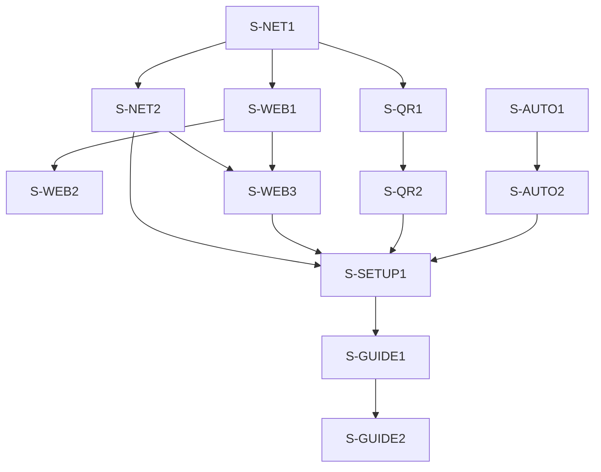

# v1.5.0 Feature Breakdown

v1.5.0 tập trung giảm ma sát cài đặt: Companion phục vụ thêm một Web Client trong LAN để iPad, tablet hoặc điện thoại dùng trình duyệt có thể hoạt động như macro pad mà không cần APK. Phiên bản này đồng thời bổ sung quét QR để APK kết nối nhanh, cho phép cấu hình port, cải thiện luồng setup, và xử lý dứt điểm regression tự khởi động cùng hệ thống.

## 0. Baseline Findings & Scope Decision

### 0.1 Baseline đã kiểm tra

* WebSocket server hiện bind cứng `0.0.0.0:8089` từ `WS_PORT`:
  `src-tauri/src/lib.rs:14`, `src-tauri/src/lib.rs:899`, `src-tauri/src/websocket.rs:27`.
* Client đã cho nhập IP và port, lưu vào `localStorage`, rồi kết nối
  `ws://<ip>:<port>`: `src/stores/connection.ts:8-9`, `src/stores/connection.ts:93`.
* Companion chưa có HTTP webserver production. Vite `localhost:1420` chỉ là dev server.
* Vue app đã có route Client `/` và Dashboard `/dashboard`; browser có thể tái sử dụng `ClientView`
  nếu Companion phục vụ static bundle: `src/main.ts:28-29`.
* Autostart không còn là feature mới: plugin, capability, Dashboard toggle và xử lý `--hidden` đã có:
  `src-tauri/Cargo.toml:21`, `src-tauri/capabilities/default.json:9`,
  `src/views/DashboardView.vue:51-71`, `src/views/DashboardView.vue:1726-1747`,
  `src-tauri/src/lib.rs:862-865`, `src-tauri/src/lib.rs:890-894`.

**Kết luận:** yêu cầu "chưa có setting khởi động cùng hệ thống / Start with Windows chưa hoạt động"
phải được xử lý như regression hoặc release packaging gap, không implement lại từ đầu.

### 0.2 Quyết định kiến trúc khuyến nghị cho v1.5.0

Giữ **hai port tách biệt**:

| Dịch vụ | Default | Mục đích |
| :--- | :--- | :--- |
| WebSocket control | `8089` | APK và Web Client gửi lệnh / nhận layout |
| HTTP Web Client | `8090` | iPad mở `http://<LAN-IP>:8090` |

Không thể bind HTTP webserver và WebSocket listener hiện tại cùng `8089`. Để iPad mở đúng
`http://IP:8089` trong một bước cần thay raw WebSocket listener bằng HTTP server hỗ trợ WebSocket
upgrade. Đây là refactor lớn hơn, nên hoãn sang phiên bản sau nếu trải nghiệm one-port thực sự cần.

### 0.3 In scope / Out of scope

**In scope**
* Cấu hình `wsPort`, `webEnabled`, `webPort`.
* Web Client trong LAN, mặc định tắt cho đến khi user bật.
* APK quét QR từ Companion để tự điền IP/WS port và kết nối.
* Companion setup UX: network settings, URL copy, hai loại QR code, cảnh báo firewall, restart rõ
  ràng và modal hướng dẫn theo ngữ cảnh.
* Browser Client tự nhận host/port, không bắt user nhập lại IP.
* Điều tra và sửa autostart trên Windows installer thực tế.

**Out of scope**
* Truy cập qua Internet hoặc cloud relay.
* Dùng chung một port HTTP + WS.
* mDNS auto-discovery.
* PIN/token pairing bắt buộc cho APK.
* HTTPS certificate tự động trong LAN.

---

## 1. FEATURE: Cấu hình port Companion và Web Client

### 1.1 Root Cause / Technical Analysis

* `WS_PORT` là compile-time constant. `get_server_info()` và startup task đều đọc constant này, nên
  Dashboard không thể thay đổi port runtime.
* WebSocket server được spawn một lần lúc Companion khởi động; chưa có supervisor hoặc shutdown
  channel để rebind listener an toàn.
* Layout được lưu trong `layout.json`. Network config nên tách riêng để không trộn preferences máy
  Companion với layout đồng bộ cho client.

### 1.2 Proposed Solution

Thêm `server.json` trong `app_config_dir()`:

```json
{
  "wsPort": 8089,
  "webEnabled": false,
  "webPort": 8090
}
```

* Rust load config trước khi spawn network services; file chưa tồn tại hoặc field lỗi thì fallback
  default an toàn.
* Validate port trong khoảng `1024..=65535`; `wsPort != webPort` khi webserver bật.
* Dashboard có form Network Settings và nút `Lưu & khởi động lại Companion`.
* Setting phải phân biệt rõ:
  - `Port đang chạy`: read-only, lấy từ listener thực tế.
  - `Port sau khi khởi động lại`: input có thể sửa.
  - Badge `Có thay đổi chưa áp dụng` nếu hai giá trị khác nhau.
* v1.5.0 áp dụng port mới sau khi restart app, không hot-rebind listener. Đây là hành vi dễ hiểu và
  ít rủi ro hơn khi cả APK lẫn browser đang kết nối.
* Mở rộng `get_server_info()` trả `ip`, `wsPort`, `webEnabled`, `webPort`, `webUrl`.

### 1.3 Stories

#### S-NET1 — Persisted server config
* **Goal:** Companion đọc/ghi network config có validation và fallback.
* **Scope:**
  - Thêm Rust struct `ServerConfig`.
  - Thêm command `get_server_config`, `save_server_config`.
  - Load `server.json` trước khi spawn WS/webserver.
  - Giữ default WS `8089` để APK cũ không bị thay đổi hành vi.
* **Complexity:** Medium

#### S-NET2 — Dashboard network settings
* **Goal:** User thấy port Companion đang chạy và cấu hình port mới mà không sửa file thủ công.
* **Scope:**
  - Thêm section `Kết nối LAN` trong settings modal.
  - Hiển thị `Port đang chạy` read-only và `Port sau khi khởi động lại` có thể sửa.
  - Hiển thị Web Client toggle và HTTP port.
  - Validate inline: port sai range, trùng port, bind lỗi.
  - Badge `Có thay đổi chưa áp dụng`; QR và HUD luôn phản ánh port listener đang chạy, không phản ánh
    draft chưa restart.
  - Nút `Lưu & khởi động lại Companion`; không giả vờ apply ngay.
* **Complexity:** Medium

---

## 2. FEATURE: Browser Web Client cho iPad / tablet

### 2.1 Root Cause / Technical Analysis

* `ClientView.vue` dùng API trình duyệt chuẩn cho phần cốt lõi: `WebSocket`, `localStorage`, CSS grid.
  Vì vậy phần macro pad có thể chạy trong Safari/Chrome mà không cần Tauri IPC.
* APK có một số tiện ích native hoặc WebView-specific. Browser LAN chạy bằng `http://IP:8090`
  không phải secure context, nên Screen Wake Lock có thể không dùng được. Macro press, layout sync,
  carousel và reconnect vẫn là phạm vi chính.
* WebSocket hiện không có authentication. Mở Web UI làm surface dễ tiếp cận hơn cho thiết bị cùng
  LAN; vì vậy webserver nên mặc định tắt và UI phải cảnh báo không bật trên Wi-Fi công cộng.
* Tính năng chống tắt màn hình (Screen Wake Lock) hiện đang kích hoạt vô điều kiện khi bật cài đặt keepScreenOn, bất kể có kết nối tới Companion hay không, gây hao pin khi máy tính/Companion không hoạt động.

### 2.2 Proposed Solution

* Thêm HTTP webserver nhẹ trong Companion, chỉ bind LAN khi `webEnabled=true`.
* Serve static browser bundle của controller tại `/`; không expose Dashboard `/dashboard`.
* Thêm endpoint `GET /api/server-info` để browser nhận `wsPort`, tránh bắt user nhập IP/port lần đầu.
* Browser derive hostname từ `location.hostname`, fetch server info, rồi tự kết nối WebSocket.
* Companion Dashboard hiển thị URL `http://<LAN-IP>:<webPort>` và QR code.
* Giữ màn hình kết nối thủ công làm fallback nếu endpoint hoặc WebSocket fail.
* Hiển thị capability note trong browser settings: giữ màn hình sáng có thể không hoạt động khi dùng
  HTTP LAN; APK vẫn là lựa chọn đầy đủ tính năng.
* Tối ưu Screen Wake Lock: Chỉ kích hoạt chống tắt màn hình khi trạng thái WebSocket là `connected` và cài đặt `keepScreenOn` bật. Tự động giải phóng Wake Lock ngay khi mất kết nối (`disconnected`, `error`) hoặc Companion tắt để thiết bị tự tắt màn hình tiết kiệm pin.

### 2.3 Stories

#### S-WEB1 — HTTP static server
* **Goal:** Companion phục vụ controller bundle trong LAN.
* **Scope:**
  - Thêm module `src-tauri/src/webserver.rs`.
  - Serve static Client shell và `/api/server-info`.
  - Chặn route Dashboard từ HTTP surface.
  - Emit bind error để Dashboard báo port conflict thay vì fail âm thầm.
  - Chọn packaging mechanism cho static bundle trong technical spike ngắn trước implementation.
* **Complexity:** High

#### S-WEB2 — Browser-aware client bootstrap
* **Goal:** Mở URL trên iPad là vào được macro pad với tối thiểu thao tác.
* **Scope:**
  - Detect browser mode trong `ClientView.vue`.
  - Derive LAN host từ URL; fetch config; tự kết nối.
  - Giữ manual IP/port fallback.
  - Ẩn hoặc giải thích rõ các setting không được browser hỗ trợ đầy đủ.
* **Complexity:** Medium

#### S-WEB3 — Web Client access card
* **Goal:** User dùng camera iPad để mở Web Client thay vì gõ IP.
* **Scope:**
  - Dashboard hiển thị Web Client URL, copy action và QR `Mở trên iPad / browser`.
  - Status rõ ràng: Disabled / Listening / Bind error.
  - Ghi chú firewall và cùng mạng LAN.
* **Complexity:** Low

---

## 3. FEATURE: Quét QR để APK kết nối Companion

### 3.1 Root Cause / Technical Analysis

* APK hiện yêu cầu user nhìn HUD trên Companion rồi nhập IP/port bằng tay trong
  `ClientView.vue`. Đây là bước dễ sai nhất khi onboarding, đặc biệt trên tablet.
* Dashboard đã có LAN IP và WS port qua `get_server_info()`, nên đủ dữ liệu để sinh QR offline.
* Không dùng browser `BarcodeDetector`: API này chưa đạt Baseline và yêu cầu secure context. Với APK
  Tauri mobile, dùng plugin native chính thức `@tauri-apps/plugin-barcode-scanner` để xin camera
  permission và scan QR ổn định hơn.

### 3.2 Proposed Solution

Dashboard hiển thị **hai QR có nhãn rõ ràng**, không gộp ý nghĩa:

| QR | Khi hiển thị | Payload | Hành vi |
| :--- | :--- | :--- | :--- |
| `Kết nối APK` | Luôn hiển thị | `android-stream-desk://connect?v=1&host=192.168.x.x&wsPort=8089` | Quét trong APK, validate, lưu IP/port và connect |
| `Mở trên iPad / browser` | Khi Web Client bật | `http://192.168.x.x:8090` | Camera hệ thống mở Safari/Chrome |

* Client modal thêm nút `Quét QR từ Companion`.
* Chỉ APK Tauri mobile hiện nút scan native; browser giữ auto-connect theo URL và manual fallback.
* Scanner dùng camera sau, format QR only, xin permission đúng lúc user nhấn nút.
* Parser chỉ nhận scheme `android-stream-desk://connect`, version hỗ trợ và port hợp lệ
  `1024..=65535`. QR sai hiển thị lỗi, không overwrite config cũ.
* Scan thành công: điền `connectionStore.ipAddress`, `connectionStore.port`, lưu `localStorage`, rồi
  connect ngay. Cho user thấy endpoint vừa nhận trước khi retry nếu kết nối thất bại.
* Payload `v=1` để có đường nâng cấp sau này cho pairing token mà không phá APK cũ.

### 3.3 Stories

#### S-QR1 — Companion APK-connect QR
* **Goal:** Dashboard sinh QR kết nối APK từ server config thực tế.
* **Scope:**
  - Thêm QR generator phía frontend, không gọi cloud API.
  - Hiển thị QR `Kết nối APK` cùng IP/WS port dạng text và copy action.
  - Regenerate khi config port đổi sau restart.
* **Complexity:** Low

#### S-QR2 — Android native QR scanner
* **Goal:** APK quét QR và kết nối Companion trong một thao tác.
* **Scope:**
  - Thêm official Tauri barcode scanner plugin cho mobile.
  - Thêm Android camera permission và capability cần thiết.
  - Client modal: nút scan, permission states, cancel, parse/validate payload, auto-connect.
  - Browser và desktop không import hoặc gọi scanner native.
* **Complexity:** Medium

### 3.4 Stretch Goal

Đăng ký deep link `android-stream-desk://connect?...` để camera hệ thống Android có thể mở APK trực
tiếp sau khi quét. Không block release: scanner bên trong APK đã giải quyết luồng chính và ít phụ
thuộc OS hơn.

Nguồn kỹ thuật:
* Official Tauri Barcode Scanner plugin:
  https://v2.tauri.app/reference/javascript/barcode-scanner/
* Official Tauri plugin catalog:
  https://v2.tauri.app/plugin/
* MDN BarcodeDetector limitations:
  https://developer.mozilla.org/en-US/docs/Web/API/BarcodeDetector

---

## 4. UX IMPROVEMENT: Setup nhanh và có chẩn đoán

### 4.1 Vấn đề hiện tại

* Companion header chỉ hiển thị `WebSocket LAN IP`; user phải tự suy luận cách dùng.
* Client modal yêu cầu nhập IP/port thủ công và tham chiếu HUD Companion.
* Autostart nằm trong settings modal nhưng không có onboarding hoặc xác nhận thành công rõ ràng.
* Khi bind port lỗi, backend emit `server-error`, nhưng Dashboard chưa biến nó thành hướng dẫn xử lý.

### 4.2 Thiết kế đề xuất

**Companion first-run checklist**
1. `Bật khởi động cùng hệ thống`
2. `Cho phép Windows Firewall` nếu được hỏi
3. `Bật Web Client` nếu dùng iPad/browser
4. Quét QR `Kết nối APK` hoặc quét QR `Mở trên iPad`
5. Hiển thị `Đã kết nối N thiết bị`

**Network card ở Dashboard**
* Tách rõ:
  - `APK / WebSocket: ws://192.168.x.x:8089`
  - `iPad / Browser: http://192.168.x.x:8090`
* Mỗi dòng có `Copy`.
* Có QR `Kết nối APK`; Web Client có QR riêng và toggle enable.
* Error state có hành động: đổi port, restart, kiểm tra firewall.

**Client browser**
* Auto-connect từ URL.
* Khi fail, hiện lỗi theo nguyên nhân: webserver vào được nhưng WS port bị chặn; Companion offline;
  thiết bị khác mạng.
* Thêm hướng dẫn `Add to Home Screen` cho iPad như stretch goal.

### 4.3 Story

#### S-SETUP1 — First-run checklist và diagnostic states
* **Goal:** User mới hiểu được đường đi từ cài Companion đến nhấn macro đầu tiên.
* **Scope:**
  - Dashboard first-run card có thể dismiss.
  - Hiển thị server-ready/server-error và số client kết nối.
  - Copy URL, QR, firewall troubleshooting.
  - Browser fallback modal dùng wording riêng thay vì giả định APK.
* **Complexity:** Medium

---

## 5. UX IMPROVEMENT: Modal hướng dẫn theo ngữ cảnh

### 5.1 Vấn đề hiện tại

* Tab `command` đã chạy shell command nhưng chỉ có cảnh báo bảo mật. User chưa có ví dụ copy-paste
  theo hệ điều hành để mở URL bằng Chrome hoặc chạy tác vụ phổ biến.
* Tab `app` đã hỗ trợ `.exe`, arguments, resolve `.lnk` và đọc clipboard file trên Windows. Tuy
  nhiên UI chưa giải thích cách lấy shortcut hoặc `Copy as path`, nên tính năng khó được phát hiện.
* Hướng dẫn setup đang nằm rải rác trong UI và README. Khi gặp lỗi, user cần chỉ dẫn ngay tại thao tác
  đang thực hiện.

### 5.2 Proposed Solution

Tạo `Guide Center` dạng modal tái sử dụng, có thể mở từ:

* Icon `?` cạnh tab `App`.
* Icon `?` cạnh tab `Command`.
* Section `Trợ giúp nhanh` trong Settings.
* Link theo ngữ cảnh từ error state: port conflict, firewall, QR scan permission, autostart.

Mỗi hướng dẫn có:

* Tiêu đề ngắn và 3-5 bước thao tác.
* Ví dụ theo OS hiện tại.
* Nút `Copy`.
* Nút `Dùng mẫu này` khi có thể điền trực tiếp vào input đang mở.
* Cảnh báo bảo mật cho command shell.

### 5.3 Nội dung modal bắt buộc

#### Guide A — Mở Chrome vào một trang web

Hiển thị mẫu theo OS:

```text
Windows: start "" chrome "https://facebook.com"
macOS:   open -a "Google Chrome" "https://facebook.com"
Linux:   google-chrome "https://facebook.com"
```

* Giải thích dùng tab `Command`, dán lệnh, thay URL rồi lưu.
* Nút `Dùng mẫu này` điền lệnh đúng OS vào `selectedButton.commandValue`.
* Windows dùng `start "" chrome ...`: chuỗi rỗng là title placeholder của `cmd start`, tránh parse sai
  khi có argument đặt trong dấu nháy.
* Linux thêm fallback `xdg-open "https://facebook.com"` nếu không cần ép mở Chrome.

#### Guide B — Thêm app bằng shortcut hoặc Copy as path

Windows:

1. Tìm app hoặc shortcut trong Desktop / Start Menu.
2. Cách nhanh: copy file shortcut bằng `Ctrl+C`, quay lại ô `Đường dẫn .exe hoặc dán shortcut (.lnk)`
   rồi nhấn `Ctrl+V`. Companion resolve `.lnk` sang target và arguments.
3. Hoặc nhấn chuột phải vào file, chọn `Copy as path`, dán vào input. Dấu nháy ngoài cùng sẽ được tự
   loại bỏ.
4. Nếu không tìm thấy file, bấm `Browse installed apps...`.

macOS:

1. Mở Finder → Applications.
2. Dùng đường dẫn app, ví dụ `/Applications/Google Chrome.app`.
3. Có thể dùng preset hoặc App Picker khi nền tảng hỗ trợ.

#### Guide C — Kết nối Client

* APK: bấm `Quét QR từ Companion`; fallback nhập `IP:WS port`.
* iPad/browser: quét QR `Mở trên iPad / browser`; fallback mở `http://IP:webPort`.
* Nếu lỗi: xác nhận cùng Wi-Fi LAN, Companion đang chạy và firewall không chặn port.

#### Guide D — Các hướng dẫn ngắn khác

* `Gán shortcut bị OS chặn`: dùng preset hoặc manual modifier thay vì record.
* `Bật khởi động cùng hệ thống`: bật toggle, Companion sẽ start ẩn trong tray ở lần login sau.
* `Import / Export layout`: backup JSON và restore.
* `Tải icon riêng`: PNG/JPG, Companion tự resize trước khi sync.

### 5.4 Stories

#### S-GUIDE1 — Reusable Guide Center modal
* **Goal:** Có một component modal dùng chung, mở đúng topic từ ngữ cảnh hiện tại.
* **Scope:**
  - Thêm `src/components/GuideCenterModal.vue`.
  - Topics typed rõ ràng: `command-chrome-url`, `app-shortcut-path`, `client-connect`, `autostart`,
    `shortcut-record`, `layout-backup`, `custom-icon`.
  - Copy action, OS-aware example và slot/callback `Dùng mẫu này`.
  - Modal scroll được trên màn hình nhỏ; nội dung không che mất input sau khi đóng.
* **Complexity:** Medium

#### S-GUIDE2 — Contextual help entry points
* **Goal:** User tìm thấy hướng dẫn ngay tại thao tác dễ sai.
* **Scope:**
  - Thêm icon `?` tại tab `App`, tab `Command` và Settings.
  - `Dùng mẫu này` điền Chrome command đúng OS.
  - Error states mở đúng guide topic.
  - Manual QA Windows/macOS; Linux verify copy text.
* **Complexity:** Low

---

## 6. BUG FIX: Autostart / Start with Windows

### 6.1 Root Cause / Technical Analysis

Code hiện tại đã có autostart end-to-end trên nhánh source, nên chưa thể kết luận root cause nếu chưa
test installer Windows. Các khả năng cần xác minh bằng evidence:

* Release installer user đang chạy chưa chứa code `v1.4.0`.
* Toggle enable thất bại nhưng UI không đưa feedback thành công/thất bại đủ rõ.
* Registry startup entry được tạo nhưng target hoặc arg `--hidden` sai.
* App đã start vào tray nhưng user không nhận biết vì Dashboard không hiển thị startup diagnostic.

### 6.2 Proposed Solution

* Reproduce trên Windows từ installer release, không chỉ `tauri dev`.
* Sau khi bật toggle: kiểm tra `isEnabled()`, startup entry, executable target, arg `--hidden`.
* Log startup mode và surface log trong Dashboard diagnostics.
* Refresh `isEnabled()` mỗi lần mở settings, không chỉ lúc component mount.
* Sau toggle hiển thị toast thành công hoặc lỗi cụ thể.
* Acceptance bắt buộc: logout/login hoặc reboot Windows; Companion xuất hiện ở tray; WS listener sẵn
  sàng; Dashboard không tự bật.

### 6.3 Stories

#### S-AUTO1 — Windows installer reproduction & root-cause fix
* **Goal:** Autostart chạy thật sau login Windows.
* **Scope:**
  - Test installer build `v1.5.0-rc`.
  - Audit startup entry, binary path, `--hidden`, tray, WS readiness.
  - Fix theo root cause đã quan sát; không rewrite plugin theo suy đoán.
* **Complexity:** Medium

#### S-AUTO2 — Discoverability & diagnostics
* **Goal:** User thấy và hiểu trạng thái autostart.
* **Scope:**
  - Refresh trạng thái khi mở modal.
  - Toast success/error.
  - Đưa autostart vào first-run checklist.
* **Complexity:** Low

---

## 7. Feature Suggestions Sau v1.5.0

| Priority | Feature | Lý do |
| :--- | :--- | :--- |
| P1 | **Preset Picker Modal cho Windows Apps/Folders** | Tách các preset Windows tiện ích (This PC, My Documents, Word, Excel, PowerPoint) vào một Modal chuyên dụng riêng biệt có kèm icon đồ họa trực quan, thay vì thả thẳng vào danh mục tabs bên phải gây chật chội UI. |
| P1 | **PIN/QR pairing + WS token** | Web access làm nhu cầu bảo vệ khỏi thiết bị lạ cùng LAN rõ hơn. Đây là bước kế tiếp trước khi mở remote access. |
| P1 | **mDNS auto-discovery** | Loại bỏ nhập IP cho APK; đã được hoãn từ kiến trúc MVP và kết hợp tốt với setup UX. |
| P1 | **Multi-action macro + delay** | Một nút chạy chuỗi shortcut/app/command; là khoảng trống chức năng lớn so với sản phẩm cùng nhóm. |
| P2 | **Profiles theo app đang active** | Tự đổi bộ nút theo game/app/workflow, giúp multi-page thực dụng hơn. |
| P2 | **Stateful toggle, slider, gauge** | Mở rộng từ button press sang volume, brightness, mic state và monitoring. |
| P2 | **PWA installable shell** | Khi browser mode ổn định, thêm manifest/service worker để ghim lên Home Screen và có app-like launch. |
| P3 | **OBS integration** | Hợp nhóm streamer, nhưng nên làm sau multi-action và pairing để không mở rộng quá sớm. |

### 7.1 Gợi ý thiết kế Preset Picker Modal (Windows)

Thiết kế một Modal chọn nhanh các phím tắt và ứng dụng phổ biến trên hệ điều hành Windows:
* **Các thư mục hệ thống:**
  - **This PC**: Đường dẫn thực thi `C:\Windows\explorer.exe shell:MyComputerFolder` (Icon: monitor/computer).
  - **My Documents**: Đường dẫn thực thi `C:\Windows\explorer.exe shell:Personal` (Icon: folder/documents).
* **Bộ ứng dụng văn phòng MS Office:**
  - **MS Word**: executable `WINWORD.EXE` (hoặc đường dẫn đầy đủ `C:\Program Files\Microsoft Office\root\Office16\WINWORD.EXE`).
  - **MS Excel**: executable `EXCEL.EXE`.
  - **MS PowerPoint**: executable `POWERPNT.EXE`.
* **Giao diện người dùng:**
  - Modal được kích hoạt qua nút "Chọn mẫu có sẵn" hoặc từ picker app.
  - Mỗi hàng/ô preset hiển thị tên ứng dụng, biểu tượng (icon) tương ứng và mô tả ngắn.
  - Khi click vào preset, tự động điền thông tin đường dẫn và icon tương ứng vào cấu hình của nút macro hiện tại.

### Market Signals

* Bitfocus Companion có Web Buttons dùng browser tablet:
  https://companion.free/user-guide/v4.2/interactive-buttons/web-buttons/
* Elgato Stream Deck Mobile nhấn mạnh profiles, folders, pages, multi-actions và nhiều keypad:
  https://www.elgato.com/us/en/s/stream-deck-mobile
* Touch Portal nhấn mạnh multi-action, pages, sliders, HTTP actions và integrations:
  https://touchportal.com/
* Screen Wake Lock chỉ dùng được trong secure context:
  https://developer.mozilla.org/en-US/docs/Web/API/Screen_Wake_Lock_API

---

## 8. Dependency Graph



## 9. Proposed Phasing

1. **Sprint 1 — Network foundation**
   - S-NET1, S-NET2, S-QR1, S-AUTO1
2. **Sprint 2 — Browser access**
   - S-WEB1, S-WEB2, S-WEB3, S-QR2
3. **Sprint 3 — Setup UX & release QA**
   - S-AUTO2, S-SETUP1, S-GUIDE1, S-GUIDE2
   - Windows installer autostart test
   - iPad Safari, Android Chrome, APK QR scan và manual-connect regression test
   - Port conflict và firewall troubleshooting test

## 10. Decisions Needed Before Implementation

1. Xác nhận giữ port tách biệt trong v1.5.0: `WS 8089`, `HTTP 8090`.
2. Xác nhận Web Client mặc định `OFF` để tránh vô tình mở control surface trên Wi-Fi công cộng.
3. Xác nhận `Add to Home Screen` chỉ là stretch goal, không block release.
4. Xác nhận Android system-camera deep link chỉ là stretch goal; luồng chính là scan bên trong APK.
5. Cung cấp môi trường đã thấy lỗi autostart: Windows version, installer asset đã cài, và biểu hiện sau
   login/reboot.
