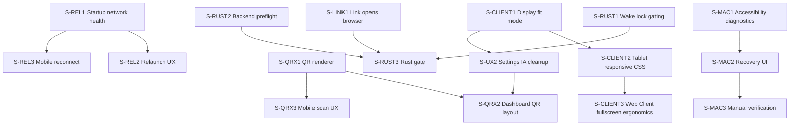

# v1.5.1 Feature Breakdown

v1.5.1 là bản hotfix ổn định sau v1.5.0, tập trung xử lý các issue GitHub đang mở, lỗi macOS không nhận Accessibility dù user đã xóa và allow lại, và các rủi ro Rust/backend/runtime hiện tại. Phạm vi release không mở thêm feature lớn; ưu tiên kết nối lại sau restart, QR quét được thật, mobile scan UI rõ hơn, button link mở được trình duyệt từ Companion, settings dễ hiểu hơn, và chẩn đoán permission macOS đủ dữ liệu để không bắt user thử mò.

---

## 0. Baseline Findings & Scope Decision

### 0.1 Issue GitHub đang mở

* [#2 — Không thể kết nối sau khi khởi động lại app từ cài đặt trên companion](https://github.com/aniadev/android-stream-desk/issues/2)
  * Repro: Companion mở, user vào settings chọn khởi động lại, sau khi app mở lại mobile không kết nối được.
  * Expected: mobile reconnect bình thường sau relaunch từ Companion.
* [#3 — Cải thiện UX: tăng cỡ font, sửa QR code, bổ sung UI quét QR](https://github.com/aniadev/android-stream-desk/issues/3)
  * Font trên Windows nhỏ.
  * QR code quá nhỏ hoặc render chưa đúng nên điện thoại không quét được.
  * Mobile cần UI quét QR chuyên biệt hơn.

### 0.2 Baseline kỹ thuật đã kiểm tra

* `cargo check --manifest-path src-tauri/Cargo.toml` pass trên macOS.
* `cargo test --manifest-path src-tauri/Cargo.toml` pass: 10 Rust tests.
* `pnpm test:qr` pass, nhưng test hiện chỉ kiểm tra SVG/string/parser cơ bản, chưa kiểm tra QR có thể scan bằng decoder chuẩn.
* `git status --short` hiện sạch, không có thay đổi local chưa commit.
* `probe_input_permission` hiện dùng `Enigo::new(&Settings::default()).is_ok()` để suy luận quyền input, không có API macOS native trả trạng thái TCC/Accessibility chi tiết: `src-tauri/src/lib.rs:796`.
* Frontend vẫn gọi `acquireWakeLock()` ngay khi mount nếu `keepScreenOn` bật, dù changelog v1.5.0 nói chỉ bật khi WebSocket `connected`: `src/views/ClientView.vue:214`.
* Button action model hiện chỉ có `shortcut | media | app | command`, chưa có action `link` riêng: `src/types/index.ts:1`. Nếu user cấu hình URL như app path, backend sẽ kiểm tra path tồn tại và fail trước khi mở browser.
* QR đang hiển thị inline trong sidebar, chưa có affordance phóng to. User cần hover thấy `zoom-in` cursor và click mở modal QR lớn để scan dễ hơn.
* Settings modal đã tích lũy nhiều nhóm cấu hình sau v1.4-v1.5, cần sắp xếp lại theo information architecture thay vì nối thêm section tuần tự.
* Client hiện có orientation setting, nhưng chưa có display fit mode cho nhiều tỉ lệ màn hình. `GridArea` đang giới hạn shell `max-w-2xl` và grid stretch theo `w-full h-full`, dễ làm button méo/nhỏ trên tablet hoặc Web Client: `src/components/GridArea.vue:108`, `src/components/GridArea.vue:151`.

### 0.3 Quyết định scope v1.5.1

**In scope**
* Fix GitHub issue #2 và #3.
* macOS Accessibility diagnostics và recovery flow: phát hiện đúng app identity/path/signature, hướng dẫn reset đúng entry, và re-probe sau user allow.
* Rà/fix bug runtime hiện có ở Rust/backend + client integration.
* Fix button link trên Companion không mở trình duyệt.
* Cải thiện UX QR: hover zoom-in, click mở modal QR lớn.
* Sắp xếp lại settings theo nhóm khoa học hơn.
* Thêm client display mode: `contain`, `cover`, và `fullscreen` cho mobile/tablet/Web Client.
* Sửa CSS responsive cho tablet xoay ngang/dọc, không để button méo hoặc quá nhỏ ở các kích thước client khác nhau.
* Bổ sung test focused cho restart/network config, QR payload/scannability, permission messaging và wake lock gating.

**Out of scope**
* Refactor một port HTTP + WebSocket.
* Pairing token/bảo mật LAN nâng cao.
* Deep link Android hệ thống mở app từ camera ngoài.
* Auto-updater/minisign production rollout.

---

## 1. BUG FIX: Mobile không kết nối lại sau relaunch từ Companion settings (#2)

### 1.1 Root Cause / Technical Analysis

* Settings lưu `server.json`, cập nhật `savedServerConfig`, rồi gọi plugin process `relaunch()` sau timeout 450ms: `src/views/DashboardView.vue:228`.
* UI hiển thị `serverPort` là port listener đang chạy; sau save, `savedServerConfig` đổi ngay nhưng listener cũ chưa restart, tạo khoảng trạng thái dễ gây QR/Web URL lệch nếu user thao tác trước relaunch hoàn tất: `src/views/DashboardView.vue:174`, `src/views/DashboardView.vue:182`.
* `get_server_info()` chỉ trả `ip` và `port`, chưa trả trạng thái listener thực tế hoặc lỗi bind cuối cùng: `src-tauri/src/lib.rs:221`.
* WebSocket server emit `server-ready` hoặc `server-error`, nhưng không có persisted startup health để Dashboard/mobile biết app mới đã bind port thành công hay chưa: `src-tauri/src/websocket.rs:27`.
* Connection store trên mobile giữ `server_ip` và `server_port` trong `localStorage`; nếu user đổi port khi restart, mobile có thể tiếp tục kết nối port cũ cho tới khi quét QR hoặc sửa tay: `src/stores/connection.ts:8`.

### 1.2 Proposed Solution & Architecture Design

* Tách rõ `configuredPort`, `runningPort`, `wsReady`, `wsBindError` trong `get_server_info`.
* Sau relaunch, Companion ghi một startup health snapshot vào state/frontend event:
  - `wsReady=true` khi bind thành công.
  - `wsBindError={port,error}` khi bind fail.
  - `webReady`/`webBindError` tương tự nếu Web Client bật.
* Dashboard chỉ cập nhật QR `Kết nối APK` theo port listener thực tế đã ready; nếu có pending restart hoặc bind error thì QR bị disable và hiển thị lỗi cổng.
* Mobile reconnect flow:
  - Khi socket close sau đã từng kết nối, thử reconnect silent theo endpoint cũ.
  - Nếu fail hết retry, modal phải gợi ý quét lại QR vì Companion có thể đã đổi port.
  - QR scan thành công phải overwrite endpoint cũ, reset reconnect counter, và connect ngay.
* Thêm manual test bắt buộc: đổi `wsPort`, bấm `Lưu và khởi động lại`, sau app reopen dùng APK cũ reconnect hoặc scan QR mới và verify macro press chạy.

### 1.3 Stories

#### S-REL1 — Startup network health contract
* **Goal:** Companion expose trạng thái listener sau startup để Dashboard biết app mới thật sự ready.
* **Scope:**
  - Mở rộng `ServerInfo` trả `configuredWsPort`, `runningWsPort`, `webEnabled`, `webPort`, `wsReady`, `wsBindError`.
  - Lưu hoặc giữ in-memory bind status cho WebSocket và HTTP webserver.
  - Dashboard render trạng thái `Listening`, `Restart pending`, `Bind error` thay vì chỉ nhìn config file.
  - Test Rust cho serialization/default và event payload.
* **Complexity:** Medium

#### S-REL2 — Relaunch UX không phát QR/URL sai trạng thái
* **Goal:** Không để user scan/copy endpoint mới trước khi listener mới đã chạy.
* **Scope:**
  - Sau save config, giữ badge `Đang áp dụng` cho tới khi app relaunch hoặc dev-mode manual restart.
  - QR `Kết nối APK` dùng `runningWsPort`, không dùng draft/persisted config chưa active.
  - Nếu relaunch fail hoặc dev mode, hiển thị checklist thao tác restart thủ công và giữ endpoint cũ.
  - Thêm test/component check cho computed `hasPendingServerChanges`, `apkConnectPayload`, `webClientUrl`.
* **Complexity:** Medium

#### S-REL3 — Mobile reconnect after Companion restart
* **Goal:** Mobile kết nối lại được sau Companion relaunch, kể cả khi port đổi.
* **Scope:**
  - Reset reconnect counter khi QR scan ghi endpoint mới.
  - Khi reconnect fail hết budget, CTA nổi bật `Quét QR lại` nếu đang Android Tauri.
  - Log endpoint đang thử kết nối vào toast/debug text để user thấy IP:port.
  - Manual QA: same port restart, changed port restart, bind error port conflict.
* **Complexity:** Medium

---

## 2. BUG FIX: macOS Accessibility đã allow lại nhưng app vẫn báo không có quyền

### 2.1 Root Cause / Technical Analysis

* Quyền Accessibility trên macOS gắn với app identity/path/code signature trong TCC. Dev build hoặc build lại app có thể tạo binary/signature khác, khiến entry cũ trong System Settings không còn áp dụng.
* Backend hiện chỉ probe bằng cách khởi tạo Enigo: `src-tauri/src/lib.rs:796`. Probe này không phân biệt:
  - app chưa có quyền Accessibility,
  - entry TCC stale,
  - app chạy từ path khác,
  - binary chưa signed/adhoc signed,
  - Enigo init fail vì nguyên nhân khác.
* Error message hiện có hướng dẫn xóa entry cũ và kéo app mới vào, nhưng chưa cho user biết bundle id/path hiện tại là gì: `src-tauri/src/lib.rs:782`.
* UI poll mỗi 3 giây khi thiếu quyền và probe lại khi focus, nhưng nếu TCC yêu cầu restart app hoặc app identity đổi, banner vẫn thiếu thông tin hành động tiếp theo: `src/views/DashboardView.vue:789`.

### 2.2 Proposed Solution & Architecture Design

* Thêm command macOS-only `get_input_permission_diagnostics`.
* Diagnostics trả object:
  - `trusted`: kết quả probe hiện tại.
  - `bundleIdentifier`: lấy từ bundle metadata nếu có.
  - `executablePath`: `std::env::current_exe()`.
  - `appBundlePath`: nếu resolve được `.app`.
  - `isPackagedApp`: phân biệt dev binary và `.app`.
  - `recommendedAction`: `allow`, `remove_stale_entry`, `restart_app`, hoặc `open_settings`.
* Với macOS, ưu tiên dùng API native `AXIsProcessTrustedWithOptions` cho prompt/open settings và `AXIsProcessTrusted` cho trạng thái, giữ Enigo probe như kiểm chứng thực thi input.
* UI banner hiển thị path/bundle id ngắn, nút `Mở Settings`, `Kiểm tra lại`, và hướng dẫn reset TCC dev build:
  - Quit app.
  - Xóa entry `Android Stream Desk`.
  - Kéo đúng `.app` hiện tại vào Accessibility.
  - Mở lại app và bấm kiểm tra.
* Không lưu `Enigo` global. Vẫn tuân thủ quy tắc project: Enigo khởi tạo động trong scope gọi.

### 2.3 Stories

#### S-MAC1 — Native Accessibility diagnostics command
* **Goal:** Backend phân biệt thiếu quyền thật với TCC stale/dev build mismatch.
* **Scope:**
  - Thêm macOS FFI/CoreFoundation hoặc crate phù hợp để gọi AX trust APIs.
  - Command `get_input_permission_diagnostics` trả struct serialize rõ ràng.
  - Giữ `probe_input_permission` tương thích cũ cho UI hiện tại.
  - Unit test phần path/bundle fallback không phụ thuộc macOS TCC.
* **Complexity:** High

#### S-MAC2 — Recovery UI cho Accessibility stale entry
* **Goal:** User biết đang allow nhầm app/path nào và làm gì tiếp theo.
* **Scope:**
  - Dashboard banner dùng diagnostics thay vì chỉ boolean.
  - Hiển thị executable/app bundle path dạng copyable.
  - Nút `Mở Accessibility Settings` và `Kiểm tra lại`.
  - Toast lỗi action phím/media link về recovery panel.
* **Complexity:** Medium

#### S-MAC3 — macOS manual verification script/checklist
* **Goal:** QA tái hiện và xác nhận fix trên dev build và packaged `.app`.
* **Scope:**
  - Cập nhật `docs/manual-test.md` với kịch bản reset Accessibility.
  - Checklist: xóa entry, allow lại packaged app, allow nhầm dev binary, restart app, chạy shortcut test.
  - Ghi rõ khi nào cần quit/reopen do TCC cache.
* **Complexity:** Low

---

## 3. BUG FIX / UX: QR code nhỏ, render chưa chuẩn, mobile scan UI chưa đủ rõ (#3)

### 3.1 Root Cause / Technical Analysis

* QR generator hiện tự viết fixed Version 4, `SIZE = 33`, `MAX_BYTE_LENGTH = 78`: `src/lib/qrSvg.ts:1`.
* Khi payload vượt giới hạn, `safeCreateQrSvg` trả chuỗi rỗng và chỉ `console.warn`, UI có thể mất QR mà không có lỗi rõ ràng: `src/lib/qrSvg.ts:247`.
* QR trong sidebar chỉ có cột 104px: `src/views/DashboardView.vue:1464`, quá nhỏ cho deep link dài khi scan từ màn hình desktop.
* Test QR hiện chưa dùng decoder QR chuẩn, nên không chứng minh mã scan được thật.
* Mobile đã có nút `Quét QR từ Companion` nhưng nằm trong modal kết nối chung và thiếu màn hình scan/retry chuyên biệt: `src/views/ClientView.vue:134`.

### 3.2 Proposed Solution & Architecture Design

* Thay QR generator tự viết bằng thư viện QR chuẩn hoặc tăng encoder để auto chọn version/error correction.
* QR desktop:
  - APK connect QR tối thiểu 192px, quiet zone rõ, contrast đen/trắng, không bị filter/glow phủ.
  - Web Client QR riêng, cùng tiêu chuẩn kích thước.
  - Hover vào QR đổi cursor thành `zoom-in`; click mở modal QR lớn tối thiểu 320-420px, có tiêu đề rõ `Kết nối APK` hoặc `Mở Web Client`, endpoint text và nút copy.
  - Nếu QR render fail, hiển thị lỗi và payload copy fallback thay vì im lặng.
* Mobile scan UI:
  - Tách thành panel `Kết nối bằng QR` rõ ràng khi chưa connected.
  - Sau scan, hiển thị endpoint nhận được `host:port` và trạng thái đang connect.
  - Permission denied có CTA mở app settings nếu plugin hỗ trợ.
* Thêm QR test dùng decoder hoặc snapshot ma trận để verify payload dài của LAN IP/port scan được.

### 3.3 Stories

#### S-QRX1 — QR renderer chuẩn và test scannability
* **Goal:** QR sinh ra từ payload APK/Web có thể quét ổn định bằng điện thoại phổ biến.
* **Scope:**
  - Thay `src/lib/qrSvg.ts` bằng implementation chuẩn hoặc dependency nhỏ.
  - Hỗ trợ payload dài hơn 78 bytes và error correction tối thiểu M/Q.
  - Test `buildApkConnectPayload` + QR decode roundtrip.
  - Không gọi cloud API.
* **Complexity:** Medium

#### S-QRX2 — Dashboard QR layout readable
* **Goal:** QR đủ lớn, rõ, có fallback copy và trạng thái lỗi.
* **Scope:**
  - Tăng kích thước QR lên tối thiểu 192px ở sidebar/settings.
  - Tách rõ `Kết nối APK` và `Mở Web Client`.
  - Hover QR dùng cursor `zoom-in`, focus state rõ cho keyboard.
  - Click QR mở modal phóng to, nền trắng không bị glow/filter, có copy payload/URL.
  - `Esc`, click backdrop, và nút close đều đóng modal.
  - Disable QR khi endpoint chưa ready hoặc bind error.
  - Responsive layout không đẩy vỡ sidebar trên Windows.
* **Complexity:** Low

#### S-QRX3 — Mobile QR scan experience
* **Goal:** Mobile user có luồng quét QR chuyên biệt và dễ retry.
* **Scope:**
  - Thiết kế panel/nút scan nổi bật trước manual IP form.
  - Permission denied/cancel/invalid QR có state riêng.
  - Scan success reset reconnect state, lưu endpoint và connect.
  - Verify Android camera permission vẫn nằm trong manifest/capability.
* **Complexity:** Medium

#### S-UX1 — Windows readability pass
* **Goal:** Tăng khả năng đọc trên Windows mà không làm vỡ dashboard dense UI.
* **Scope:**
  - Audit các lớp `text-[8px]`, `text-[9px]`, `text-[10px]` trong Dashboard.
  - Thiết lập token font tối thiểu cho HUD/body/control label.
  - Kiểm tra các button không overflow ở desktop 1366x768 và 1920x1080.
  - Không biến dashboard thành landing page; giữ density cho tool vận hành.
* **Complexity:** Low

#### S-UX2 — Settings information architecture cleanup
* **Goal:** Settings dễ tìm, dễ scan, không còn cảm giác các tính năng bị nhồi chung một màn hình.
* **Scope:**
  - Chia settings thành nhóm rõ: `General`, `Network`, `Client & QR`, `Permissions`, `Updates`, `Import/Export`, `About/Support`.
  - Đưa autostart, restart/network config, Web Client URL/QR, Accessibility, updater và donation/support về đúng nhóm.
  - Giữ action nguy hiểm như relaunch/restart ở khu vực có mô tả trạng thái và disabled state rõ.
  - Trên màn hình thấp, settings phải scroll tốt, header/footer action không che nội dung.
  - Không lồng card trong card; dùng section band/inset theo design system hiện tại.
* **Complexity:** Medium

---

## 4. UX / BUG FIX: Client fit mode và responsive tablet layout

### 4.1 Root Cause / Technical Analysis

* Client settings hiện có orientation lock (`auto`, `landscape`, `portrait`, `landscape-reverse`) nhưng chưa có cách chọn chiến lược scale lưới theo màn hình: `src/views/ClientView.vue:60`.
* `GridArea` dùng shell `w-full h-full max-w-2xl`, nên trên tablet hoặc Web Client màn hình rộng, lưới có thể bị giới hạn quá nhỏ thay vì tận dụng viewport: `src/components/GridArea.vue:108`.
* Grid button đang stretch theo `gridTemplateColumns/Rows` và `w-full h-full`; khi tỉ lệ viewport khác tỉ lệ lưới, button bị dẹt, méo hoặc quá nhỏ: `src/components/GridArea.vue:151`.
* Web Client chạy trong browser có thêm biến số address bar, safe area, viewport dynamic height, iPad/tablet portrait/landscape; CSS hiện chưa có breakpoint/container query riêng cho các trường hợp này.

### 4.2 Proposed Solution & Architecture Design

* Thêm setting client-side `displayFitMode` lưu localStorage:
  - `contain`: giữ toàn bộ lưới trong viewport, không cắt nội dung; ưu tiên scan toàn bộ layout.
  - `cover`: lưới phủ tối đa viewport, có thể crop shell/padding nhẹ; ưu tiên button lớn khi dùng như stream deck cố định.
  - `fullscreen`: bỏ shell/padding trang trí nhiều nhất có thể, dùng toàn bộ viewport; ưu tiên Web Client/tablet kiosk mode.
* `GridArea` nhận fit mode từ settings store và áp class/layout token tương ứng.
* Dùng CSS ổn định theo container:
  - Giữ tỉ lệ button hợp lý bằng `aspect-ratio`, `minmax`, hoặc scale wrapper thay vì để button stretch méo tự do.
  - Tách spacing/padding cho phone, tablet portrait, tablet landscape.
  - Dùng `100dvh`/safe-area inset cho browser mobile thay vì chỉ `h-screen` khi phù hợp.
* Settings Client thêm segmented control `Contain / Cover / Fullscreen`, đặt gần orientation vì cùng nhóm hiển thị.
* Acceptance không yêu cầu mọi grid đều vuông tuyệt đối, nhưng không được có button bị méo khó bấm, text/icon tràn, hoặc lưới nhỏ bất thường trên tablet.

### 4.3 Stories

#### S-CLIENT1 — Client display fit mode setting
* **Goal:** User chọn được cách lưới chiếm màn hình theo thiết bị và use case.
* **Scope:**
  - Thêm `displayFitMode: 'contain' | 'cover' | 'fullscreen'` vào `src/stores/settings.ts`.
  - Client settings modal thêm segmented control với icon rõ, lưu localStorage.
  - `GridArea` nhận mode và áp class/layout tương ứng.
  - Default khuyến nghị: `contain` để không cắt layout trên thiết bị lạ.
  - Manual QA Web Client: đổi mode không cần reconnect/reload.
* **Complexity:** Medium

#### S-CLIENT2 — Tablet portrait/landscape responsive CSS
* **Goal:** Button không bị méo/quá nhỏ khi dùng mobile/tablet ở các tỉ lệ màn hình khác nhau.
* **Scope:**
  - Audit `ClientView.vue`, `GridArea.vue`, `GridButton.vue` theo viewport phone, tablet portrait, tablet landscape, desktop browser.
  - Bỏ hard limit gây nhỏ bất thường khi Web Client có nhiều không gian, hoặc chỉ áp limit ở mode `contain`.
  - Tối ưu grid gap/padding theo breakpoint/container, tránh fixed padding quá lớn trên màn hình thấp.
  - Kiểm tra layout với grid phổ biến: `3x3`, `4x4`, `5x3`, `6x4`, multi-page.
  - Không để HUD/settings pill che button ở fullscreen mode; cần safe area hoặc auto-hide/compact.
* **Complexity:** Medium

#### S-CLIENT3 — Web Client fullscreen ergonomics
* **Goal:** Web Client dùng như macro pad trên tablet browser có trải nghiệm gần app native.
* **Scope:**
  - Với mode `fullscreen`, giảm shell decoration, padding và corner ornament để tối đa vùng bấm.
  - Dùng `100dvh` và safe-area CSS cho iPad/Android browser.
  - Nếu browser không thể lock orientation/fullscreen, UI vẫn scale đúng.
  - Manual QA Safari/Chrome tablet portrait/landscape; không bắt buộc Fullscreen API vì Web Client LAN có thể không có gesture/secure-context đầy đủ.
* **Complexity:** Medium

---

## 5. BUG FIX: Runtime issues Rust/backend/client hiện tại

### 5.1 Root Cause / Technical Analysis

* Rust compile/test hiện pass, nên rủi ro chính là behavior runtime:
  - Network restart health chưa observable đầy đủ.
  - Permission macOS chưa đủ diagnostics.
  - QR renderer chưa được chứng minh scan được.
  - Wake lock đang bật khi mount nếu setting bật, chưa chờ `connected`: `src/views/ClientView.vue:214`.
  - Button link trên Companion không mở trình duyệt vì action model chưa có `link` riêng và backend `app` path flow yêu cầu path tồn tại trước khi spawn: `src/types/index.ts:1`, `src-tauri/src/lib.rs:903`.
* WebSocket global broadcaster dùng `WS_MUTEX` chứa sender mới sau mỗi server start; với relaunch process mới ổn, nhưng nếu sau này hot-rebind sẽ cần shutdown/swap lifecycle rõ ràng: `src-tauri/src/websocket.rs:20`.
* Web server dùng `include_dir!("$CARGO_MANIFEST_DIR/../dist-client")`; release build phải đảm bảo `dist-client` luôn được tạo trước Tauri compile: `src-tauri/src/webserver.rs:7`.

### 5.2 Proposed Solution & Architecture Design

* Không mở refactor lớn. Thêm verification và guard tại các điểm runtime đang rủi ro.
* Wake lock chỉ acquire qua watcher khi `keepScreenOn && status === 'connected'`; bỏ acquire vô điều kiện trong `onMounted`.
* Thêm action type `link` riêng cho URL mở trình duyệt:
  - Frontend validate `http://` và `https://`, lưu field `linkUrl`.
  - Backend command/action executor mở URL bằng cơ chế shell/system browser đúng nền tảng.
  - Không dùng shell raw command cho link thông thường để giảm lỗi quoting và rủi ro injection.
* Thêm test/script preflight cho `dist-client` trước build release hoặc tài liệu hóa trong release checklist.
* Rust tests giữ pass; thêm test nhỏ cho server info/status nếu thêm contract mới.

### 5.3 Stories

#### S-RUST1 — Wake lock connected-only enforcement
* **Goal:** Đúng cam kết v1.5.0: không giữ màn hình sáng khi chưa kết nối Companion.
* **Scope:**
  - Bỏ `acquireWakeLock()` vô điều kiện trong `onMounted`.
  - Đảm bảo visibility handler chỉ reacquire khi connected.
  - Manual test Android/Web: bật setting, mở app khi Companion tắt, màn hình không bị giữ sáng.
* **Complexity:** Low

#### S-LINK1 — Companion link button opens default browser
* **Goal:** Button cấu hình URL mở được trình duyệt mặc định khi bấm từ mobile/client qua Companion.
* **Scope:**
  - Thêm `ActionType = 'link'` và field `linkUrl?: string` vào shared types/layout sanitizer.
  - Dashboard thêm tab/action editor `Link` với input URL, validate `http://`/`https://`, preview domain và helper text ngắn.
  - Rust `ButtonConfig` nhận `linkUrl`; `execute_logic` route action `link` sang hàm `open_link`.
  - `open_link` dùng API nền tảng an toàn: Windows `cmd /c start` hoặc plugin shell/open phù hợp, macOS `open`, Linux `xdg-open`; URL phải được truyền như argument, không nối chuỗi shell.
  - Toast lỗi rõ khi URL invalid hoặc spawn browser fail.
  - Test parser/sanitizer cho link URL và manual QA bấm link từ APK/Web Client.
* **Complexity:** Medium

#### S-RUST2 — Backend startup/build preflight
* **Goal:** Release không fail ngầm vì thiếu `dist-client` hoặc bind service lỗi.
* **Scope:**
  - Thêm release checklist hoặc script kiểm tra `dist-client/index.html` trước Tauri build.
  - Log rõ `server-ready`, `server-error`, `server-web-ready`, `server-web-error`.
  - Đưa bind error vào Dashboard health UI của S-REL1.
* **Complexity:** Low

#### S-RUST3 — Rust regression test pass gate
* **Goal:** Bản hotfix không làm hỏng backend đã ổn compile.
* **Scope:**
  - Giữ pass `cargo check --manifest-path src-tauri/Cargo.toml`.
  - Giữ pass `cargo test --manifest-path src-tauri/Cargo.toml`.
  - Thêm test cho diagnostics/status structs nếu có.
* **Complexity:** Low

---

## 6. Summary & Deployment Plan v1.5.1

### Dependency Graph



### Complexity & Impact Matrix

| Story | Feature / Bug Fix | Complexity | Front-end Only? |
| :--- | :--- | :--- | :--- |
| S-REL1 | Startup network health contract | Medium | No |
| S-REL2 | Relaunch UX không phát endpoint sai | Medium | Mostly frontend |
| S-REL3 | Mobile reconnect sau restart | Medium | Mostly frontend |
| S-MAC1 | Native macOS Accessibility diagnostics | High | No |
| S-MAC2 | Accessibility recovery UI | Medium | Mostly frontend |
| S-MAC3 | Manual verification docs | Low | Docs |
| S-QRX1 | QR renderer chuẩn + decode tests | Medium | Yes |
| S-QRX2 | Dashboard QR readable | Low | Yes |
| S-QRX3 | Mobile QR scan UX | Medium | Yes |
| S-UX1 | Windows readability pass | Low | Yes |
| S-UX2 | Settings information architecture cleanup | Medium | Yes |
| S-CLIENT1 | Client display fit mode setting | Medium | Yes |
| S-CLIENT2 | Tablet portrait/landscape responsive CSS | Medium | Yes |
| S-CLIENT3 | Web Client fullscreen ergonomics | Medium | Yes |
| S-RUST1 | Wake lock connected-only | Low | Yes |
| S-LINK1 | Companion link button mở browser | Medium | No |
| S-RUST2 | Backend startup/build preflight | Low | No |
| S-RUST3 | Rust regression gate | Low | No |

### New Files Expected

```text
src-tauri/src/accessibility.rs                  (S-MAC1) - macOS Accessibility diagnostics
src/lib/qrDecodeRoundtrip.test.mjs              (S-QRX1) - QR scannability/roundtrip tests
```

### Modified Files Expected

```text
src-tauri/src/lib.rs                            (S-REL1, S-MAC1, S-LINK1, S-RUST2) - server info, diagnostics commands, link execution, event/status contract
src-tauri/src/websocket.rs                      (S-REL1, S-RUST2) - ready/error status emission
src-tauri/src/webserver.rs                      (S-REL1, S-RUST2) - HTTP ready/error status consistency
src/views/DashboardView.vue                     (S-REL2, S-MAC2, S-QRX2, S-UX1, S-UX2, S-LINK1) - network health, QR layout/modal, permission UI, font/settings pass, link editor
src/views/ClientView.vue                        (S-REL3, S-QRX3, S-CLIENT1, S-CLIENT3, S-RUST1) - reconnect, scan UI, client display settings, wake lock gating
src/components/GridArea.vue                     (S-CLIENT1, S-CLIENT2, S-CLIENT3) - fit mode layout, tablet responsive grid shell
src/components/GridButton.vue                   (S-CLIENT2) - button sizing resilience across viewport ratios
src/stores/settings.ts                          (S-CLIENT1) - persist display fit mode
src/stores/connection.ts                        (S-REL3) - reconnect reset/diagnostics after endpoint change
src/stores/layout.ts                            (S-LINK1) - sanitize/import link action field
src/types/index.ts                              (S-LINK1) - add link action type and linkUrl field
src/lib/qrSvg.ts                                (S-QRX1) - replace or upgrade QR encoder
src/lib/apkConnectQr.test.mjs                   (S-QRX1, S-QRX3) - parser and payload coverage
docs/manual-test.md                             (S-MAC3, S-REL3, S-QRX2, S-LINK1, S-UX2) - release verification checklist
CHANGELOG.md                                    (Release) - v1.5.1 notes
package.json                                    (Release) - version bump and optional QR test script
src-tauri/Cargo.toml                            (Release, S-MAC1 optional) - version bump and optional macOS dependency
src-tauri/tauri.conf.json                       (Release) - version bump
```

### Proposed Phasing

1. **Sprint 1 — Critical stability** (0.5-1 ngày)
   - S-REL1, S-REL2, S-REL3.
   - S-RUST1 vì nhỏ và đang lệch changelog v1.5.0.
   - S-LINK1 vì đang làm hỏng một loại button user-facing.
2. **Sprint 2 — macOS Accessibility recovery** (0.5-1 ngày)
   - S-MAC1, S-MAC2, S-MAC3.
3. **Sprint 3 — QR/UX polish và release gate** (0.5-1 ngày)
   - S-QRX1, S-QRX2, S-QRX3, S-UX1, S-UX2, S-CLIENT1, S-CLIENT2, S-CLIENT3, S-RUST2, S-RUST3.

### Release & Deployment Notes

#### 1. Pre-release Verification

```bash
pnpm test:qr
pnpm build
cargo check --manifest-path src-tauri/Cargo.toml
cargo test --manifest-path src-tauri/Cargo.toml
```

Manual checks bắt buộc:
* macOS: reset Accessibility entry, allow lại packaged `.app`, chạy shortcut và media key.
* Restart: đổi port, `Lưu và khởi động lại`, mobile reconnect hoặc scan QR mới.
* QR: scan APK connect QR từ màn hình Windows/macOS bằng ít nhất 2 camera app khác nhau.
* QR modal: hover QR thấy cursor zoom-in, click mở modal lớn, `Esc`/backdrop/close đóng được.
* Link button: tạo button link `https://github.com`, bấm từ APK/Web Client và xác nhận trình duyệt mặc định mở trên Companion.
* Settings: kiểm tra nhóm settings ở 1366x768 và 1920x1080, không overflow/che action.
* Client fit mode: kiểm tra `contain`, `cover`, `fullscreen` trên APK và Web Client, đổi mode không cần reconnect.
* Tablet CSS: kiểm tra phone portrait, phone landscape, tablet portrait, tablet landscape, desktop browser với grid `3x3`, `4x4`, `5x3`, `6x4`.
* Android: camera permission denied/cancel/success states.

#### 2. Version Bumps

* `package.json`: `"version": "1.5.1"`
* `src-tauri/Cargo.toml`: `version = "1.5.1"`
* `src-tauri/tauri.conf.json`: `"version": "1.5.1"`

#### 3. Update Changelog

```markdown
## [1.5.1] - 2026-06-04

### Fixed
- Sửa lỗi mobile không kết nối lại sau khi Companion relaunch từ settings.
- Sửa luồng macOS Accessibility stale entry/diagnostics.
- Sửa QR code quá nhỏ hoặc render không scan được.
- Sửa wake lock bật khi chưa connected.
- Sửa button link trên Companion không mở trình duyệt.
- Sửa layout client bị méo/quá nhỏ trên tablet và Web Client ở nhiều tỉ lệ màn hình.

### Changed
- Cải thiện UX scan QR trên mobile, QR zoom modal, readability trên Windows, cấu trúc settings và display fit mode cho client.
```

#### 4. GitHub Issue Closure Criteria

* Close #2 khi manual QA chứng minh mobile reconnect sau Companion restart ở cả same-port và changed-port case.
* Close #3 khi QR scan được thật, QR có modal phóng to, font Windows dễ đọc hơn, mobile có scan UI rõ ràng, settings được nhóm lại dễ tìm, và client tablet/Web Client có fit mode + CSS responsive ổn định.

#### 5. Recommended Tag

Vì v1.5.1 chạm cả Companion desktop và Android client:

```bash
git tag v1.5.1
git push origin main
git push origin v1.5.1
```
