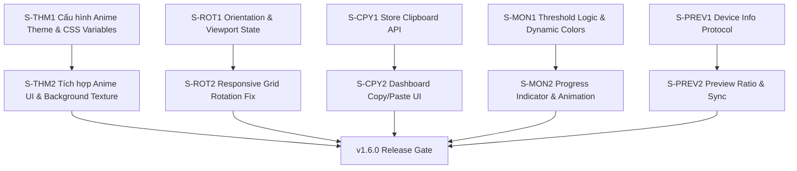

# v1.6.0 Feature Breakdown

v1.6.0 mang đến Pastel Soft Anime Theme phủ cả Companion và Client, sửa lỗi layout Client bị vỡ khi xoay ngang/dọc trên thiết bị di động, bổ sung Copy/Paste/Duplicate cấu hình nút bấm trên Dashboard, và nâng cấp nút Monitor RAM/CPU bằng chỉ số trực quan kèm cảnh báo động. Phạm vi release chủ yếu nằm ở Vue/TypeScript, CSS, layout store, tài liệu kiểm thử và release metadata; không dự kiến thay đổi Rust backend runtime ngoài các lệnh verify release.

---

## 0. Baseline & Scope Decision

### 0.1 Baseline hiện tại

* Repo hiện đang ở `1.5.2` tại `package.json`, `src-tauri/Cargo.toml`, `src-tauri/tauri.conf.json`, và `src/views/DashboardView.vue`.
* Theme core hiện chỉ có `cyber`, `midnight`, `ember` trong `src/lib/themes.ts`.
* `src/assets/tailwind.css` chỉ có CSS variable blocks cho 3 theme hiện tại, chưa có token shape/font/background texture cho anime.
* `GridArea.vue` đã có listener `resize` để realign scroll-snap theo `currentPageIndex`, nhưng chưa có viewport state/token chuyên biệt cho orientation settle, chưa cập nhật `--vh`, và chưa xử lý `visualViewport` cho Android WebView.
* `src/stores/layout.ts` chưa có clipboard state/API cho button config; Dashboard hiện chỉ có các flow clipboard riêng lẻ cho IP/QR/path/color.
* `GridButton.vue` đã render monitor button bằng icon + phần trăm, nhưng chưa có threshold classification, warning/critical visual state, hoặc progress ring/bar.

### 0.2 Sprint status gate

Trước khi chạy `bmad-sprint-planning` hoặc tạo story v1.6.0, Epic 11, Epic 12, và Epic 13 trong `_bmad-output/implementation-artifacts/sprint-status.yaml` phải được đóng (`done`) hoặc ghi rõ là deferred. Các story v1.6.0 dưới đây giả định baseline là codebase sau khi quyết định đó đã hoàn tất; không trộn scope review còn mở của v1.5.1/v1.5.2 vào batch này.

### 0.3 In scope

* Thêm `anime` vào hệ thống theme chính và đồng bộ type/theme config liên quan.
* Áp dụng Anime visual treatment cho Dashboard và Client bằng CSS variables, không thêm remote font dependency.
* Sửa layout Client khi thiết bị xoay orientation, bao gồm Android WebView height fallback.
* Thêm copy/paste/duplicate button config trên Companion Dashboard với clipboard in-memory.
* Nâng cấp monitor button bằng threshold state và visual progress indicator.
* Tự động nhận diện thiết bị Client (kích thước viewport, tên thân thiện) qua WebSocket và điều chỉnh tỷ lệ khung hình (Aspect Ratio) của khung Preview trên Companion theo thời gian thực.
* Đồng bộ hóa hình nền và hiệu ứng theme (như theme Genshin) từ Client lên Preview Companion.
* Cập nhật manual test, changelog, release version metadata và release gates.

### 0.4 Out of scope

* Thay đổi Rust backend metric collection hoặc WebSocket protocol ngoài việc dùng `metric_update` hiện có.
* Thêm font asset mới, tải font từ mạng, hoặc đổi toàn bộ typography engine.
* Redesign toàn bộ Dashboard settings IA.
* Tạo pairing/security model mới cho Client.
* Đóng các story Epic 11-13 còn review; việc đó là entry gate riêng trước v1.6.0.

---

## 1. FEATURE 1: Hệ thống Theme mới & Anime Theme

### 1.1 Root Cause / Technical Analysis

* Hệ thống theme hiện tại (`src/lib/themes.ts`) định nghĩa cứng 3 theme: `cyber`, `midnight`, `ember` với cấu hình accent HSL cơ bản.
* CSS hiện tại (`src/assets/tailwind.css`) mới định nghĩa các CSS variables cho 3 theme cũ, thiếu token cho hình dạng nút bấm (`--theme-btn-radius`), font family (`--theme-font-family`), và texture nền đặc thù cho phong cách anime.
* Dashboard settings render theme option từ `THEMES`, nên thêm theme core đúng cách sẽ tự xuất hiện trên Companion; Client nhận theme qua layout sync/localStorage, nhưng cần đảm bảo old layout fallback về `cyber`.
* Landing page có type theme riêng tại `landing-page/src/types/landing.ts`; nếu muốn hiển thị/sync theme anime trong landing UI thì phải cập nhật type và theme map tương ứng.

### 1.2 Proposed Solution & Architecture Design

* **Cấu trúc dữ liệu Theme:** Mở rộng `ThemeName` thêm `'anime'`. Cập nhật `THEMES` trong `src/lib/themes.ts`, `landing-page/src/types/landing.ts`, và landing-page theme map nếu type change làm lộ compile error.
* **CSS Variables bổ sung:** Thêm cấu hình `:root[data-theme="anime"]` trong `src/assets/tailwind.css` với các token:
  - `--theme-bg`: nền tối pastel violet `#181625`.
  - `--theme-btn-bg` / `--theme-btn-hover`: nền nút bán trong suốt với ánh hồng đào nhẹ.
  - `--theme-accent`: hồng pastel `#ff79c6`.
  - `--theme-corner-a` / `--theme-corner-b`: hồng phấn và oải hương.
  - `--theme-shell-top` / `--theme-shell-bottom` / `--theme-shell-border`: glow nhẹ hơn cyber.
  - `--theme-btn-radius`: `1.25rem`.
  - `--theme-font-family`: system rounded stack, ví dụ `ui-rounded, "SF Pro Rounded", "Segoe UI", system-ui, sans-serif`.
* **Font strategy:** Không tải font từ mạng và không thêm font asset trong v1.6.0. Anime theme dùng CSS variable + system fallback để giữ app hoạt động offline và tránh tăng bundle size.
* **Background Texture:** Thêm radial-dot/pastel gradient variant chỉ kích hoạt khi `data-theme="anime"`, giữ các theme cũ không đổi.

### 1.3 Stories

#### S-THM1 — Cấu hình Theme Anime & CSS Variables

* **Goal:** Tích hợp theme `'anime'` vào hệ thống theme cốt lõi và định nghĩa token style cần thiết.
* **Scope:**
  - Cập nhật `ThemeName` và `THEMES` trong `src/lib/themes.ts`.
  - Cập nhật `landing-page/src/types/landing.ts` và landing-page theme map nếu compile yêu cầu.
  - Thêm cấu hình CSS cho `:root[data-theme="anime"]` tại `src/assets/tailwind.css`.
  - Thêm default token `--theme-btn-radius` và `--theme-font-family` cho `:root` và các theme cũ để tránh undefined CSS variable.
* **Acceptance Criteria:**
  - `isValidTheme('anime')` trả true và `applyTheme('anime')` set `data-theme="anime"`.
  - Layout JSON có `theme: "anime"` được load/sync bình thường; layout cũ không có `theme` vẫn fallback `cyber`.
  - Dashboard theme picker hiển thị Anime với preview color riêng.
  - `pnpm vue-tsc --noEmit` pass sau khi cập nhật type/theme map.
* **Complexity:** Medium

#### S-THM2 — Tích hợp Anime UI & Background Texture trên Client/Companion

* **Goal:** Hiển thị đúng style Anime trên cả Dashboard và Client mà không làm regress 3 theme hiện có.
* **Scope:**
  - Sử dụng CSS variables cho `border-radius` và `font-family` của `GridButton.vue`.
  - Thêm background texture/pastel shell treatment trong `GridArea.vue` hoặc CSS global với selector `data-theme="anime"`.
  - Đảm bảo Dashboard và Client cùng nhận theme từ `layout.theme` / `localStorage` / layout sync.
  - Không thêm remote font, không thêm file asset font mới.
* **Acceptance Criteria:**
  - Chọn Anime trên Dashboard làm Dashboard đổi theme và Client đang connected đổi theo qua `sync_layout`.
  - Reload Dashboard/Client giữ theme Anime từ localStorage/layout.
  - `cyber`, `midnight`, `ember` giữ layout, màu, radius và readability như trước.
  - Anime texture không che nội dung, không làm QR scanner transparent mode bị che bởi background app.
* **Complexity:** Medium

---

## 2. BUG FIX: Lỗi hiển thị xoay ngang/dọc trên Client

### 2.1 Root Cause / Technical Analysis

* Khi người dùng thay đổi orientation trên thiết bị di động, `window.innerWidth`, `window.innerHeight`, safe-area inset và Android WebView viewport có thể cập nhật lệch nhịp.
* `GridArea.vue` hiện đã listen `resize` để realign scroll snap, nhưng logic này chỉ gọi `scrollToIndex(currentPageIndex)`; nó chưa tạo viewport state reactive, chưa chờ orientation settle, chưa cập nhật CSS `--vh`, và chưa dùng `visualViewport` khi có.
* Parent `ClientView.vue` đang dùng `h-dvh`; trên một số Android WebView cũ, `dvh` có thể cập nhật trễ khiến grid lấy chiều cao stale và button bị méo/tràn.
* Grid hiện stretch theo `repeat(rows/cols, minmax(0, 1fr))`; thiếu trigger rõ ràng sau orientation settle có thể làm gap/padding/page width lệch, đặc biệt khi đang ở multi-page scroll snap.

### 2.2 Proposed Solution & Architecture Design

* **Viewport state/token:** Trong `ClientView.vue`, thêm `viewportSize = ref({ width, height, visualWidth, visualHeight, orientationKey })` và cập nhật bằng hàm debounced khi `resize`, `orientationchange`, và `visualViewport.resize` xảy ra.
* **CSS `--vh` fallback:** Mỗi lần viewport update, set CSS variable `--vh` bằng 1% chiều cao viewport hiện tại; dùng fallback này cho Client container khi cần.
* **Grid trigger:** Truyền `viewportSize` hoặc `orientationKey` xuống `GridArea.vue` để watcher `flush: 'post'` realign scroll snap sau DOM layout mới.
* **Responsive layout:** Cập nhật `GridArea.vue`/`GridButton.vue` để button giữ kích thước ổn định bằng `aspect-ratio`, `minmax(0, 1fr)`, bounded padding/gap và không overflow khi portrait/landscape.
* **Manual test bắt buộc:** Test Android WebView thật với `contain`, `cover`, `fullscreen`, grid 2x2, 3x3, 6x8, multi-page, và safe-area.

### 2.3 Stories

#### S-ROT1 — Lắng nghe orientation & cập nhật viewport state

* **Goal:** Bắt đúng thời điểm viewport đổi khi xoay và phát tín hiệu reactive cho layout tính lại.
* **Scope:**
  - Thêm listener trong `ClientView.vue` cho `resize`, `orientationchange`, và `visualViewport.resize` nếu có.
  - Debounce 100-150ms để tránh tính toán khi Android WebView chưa settle.
  - Cập nhật `--vh`, `viewportSize`, và cleanup listeners trong `onUnmounted`.
  - Truyền `viewportSize` hoặc `orientationKey` vào `GridArea.vue`.
* **Acceptance Criteria:**
  - Xoay portrait -> landscape -> portrait không để Client container dùng chiều cao stale.
  - Không leak listener sau route unmount/remount.
  - Multi-page Client vẫn giữ đúng current page sau orientation change.
  - `pnpm vue-tsc --noEmit` pass.
* **Complexity:** Low

#### S-ROT2 — Tối ưu CSS Grid & Responsive Layout theo hướng xoay

* **Goal:** Grid co giãn ổn định, không méo button, không mất HUD/settings khi xoay dọc/ngang.
* **Scope:**
  - Cập nhật `GridArea.vue` watcher theo `viewportSize`/`orientationKey` để realign scroll snap sau DOM update.
  - Áp dụng `aspect-ratio` hoặc bounded sizing cho button/grid cell để tránh kéo dài quá mức.
  - Kiểm tra gap/padding cho `contain`, `cover`, `fullscreen` ở 16:9, 4:3, 21:9, portrait hẹp, và landscape thấp.
  - Cập nhật `docs/manual-test.md` với kịch bản xoay thiết bị thật.
* **Acceptance Criteria:**
  - Android Client 3x3 và 6x8 không overflow khỏi viewport sau khi xoay 3 lần liên tiếp.
  - Settings HUD/scan-again CTA vẫn bấm được sau orientation change.
  - Button label/icon không chồng nhau ở compact/fullscreen mode.
  - Manual test ghi rõ thiết bị/emulator, orientation, fit mode và kết quả.
* **Complexity:** Medium

---

## 3. FEATURE 2: Copy/Paste/Duplicate cấu hình button trên Companion

### 3.1 Root Cause / Technical Analysis

* Dashboard Companion hiện yêu cầu cấu hình thủ công từng nút từ đầu, kể cả khi user chỉ muốn tạo nhiều nút tương tự nhau.
* `src/stores/layout.ts` có API layout/page/update/import/export, nhưng chưa có clipboard state cho `ButtonConfig`.
* Dashboard có nhiều flow clipboard khác nhau cho IP/QR/path/color, nhưng chưa có action copy/paste/duplicate cấu hình button.
* Copy/paste phải tránh duplicate `id`, phải preserve monitor button config, và phải broadcast/save layout giống các chỉnh sửa button hiện tại.

### 3.2 Proposed Solution & Architecture Design

* **Clipboard state:** Thêm `copiedButton = ref<Omit<ButtonConfig, 'id'> | null>(null)` trong `layout.ts`. Clipboard này chỉ in-memory trong session, không persist vào localStorage.
* **Copy semantics:** `copyButtonConfig(config)` clone toàn bộ field hợp lệ của button, bao gồm `buttonKind`, `monitorConfig`, `iconSizing`, `linkUrl`, command/app/media/shortcut fields, nhưng bỏ `id`.
* **Paste semantics:** `pasteButtonConfig(targetId)` tìm button trên current page, tạo `id` mới, merge clone vào target slot, gọi `updateLayout({ ...layout.value })`, broadcast sync và save local layout.
* **Duplicate semantics:** `duplicateButtonConfig(sourceId)` copy source và paste vào slot trống đầu tiên trên current page; nếu không có slot trống thì trả false/toast để user biết cần tăng grid hoặc đổi page.
* **Keyboard shortcuts:** Chỉ bắt Ctrl/Cmd+C và Ctrl/Cmd+V khi Dashboard focus vào grid/button selection, không chặn khi target là input/textarea/select/contenteditable.

### 3.3 Stories

#### S-CPY1 — Layout Store Clipboard State & Button Clone API

* **Goal:** Triển khai API/State lưu trữ và paste cấu hình nút bấm an toàn trong store.
* **Scope:**
  - Thêm `copiedButton`, `hasCopiedButton`, `copyButtonConfig(config)`, `pasteButtonConfig(targetId)`, và `duplicateButtonConfig(sourceId)` vào `layout.ts`.
  - Tạo helper clone button bỏ `id`, preserve monitor/action fields, và tạo `id` mới khi paste/duplicate.
  - Đảm bảo paste/duplicate chỉ thao tác current page trừ khi API truyền pageId rõ ràng trong tương lai.
  - Thêm focused unit test nếu repo có test harness phù hợp; nếu chưa, thêm manual test checklist rõ trong `docs/manual-test.md`.
* **Acceptance Criteria:**
  - Copy action button rồi paste vào button khác giữ label, icon, background, actionType và action payload; `id` mới không trùng source/target.
  - Copy monitor button rồi paste giữ `buttonKind: "monitor"` và `monitorConfig`.
  - Duplicate chọn slot trống đầu tiên trên current page; nếu không còn slot trống thì không mutate layout và trả trạng thái fail.
  - Paste/duplicate gọi update/broadcast để Client nhận layout mới khi connected.
* **Complexity:** Low

#### S-CPY2 — Dashboard UI Copy/Paste & Button Context Actions

* **Goal:** Bổ sung thao tác Copy/Paste/Duplicate trực quan trong Button Editor và keyboard shortcut không phá input editing.
* **Scope:**
  - Thêm nút icon Copy, Paste, Duplicate trong Sidebar Editor khi có selected button.
  - Disable Paste khi `hasCopiedButton` false; hiển thị toast/hint ngắn khi copy/paste/duplicate thành công hoặc fail.
  - Thêm Ctrl/Cmd+C và Ctrl/Cmd+V cho selected button khi focus không nằm trong input/textarea/select/contenteditable.
  - Đảm bảo click grid vẫn select button như trước, không trigger press trên Dashboard.
* **Acceptance Criteria:**
  - User có thể copy button A, select button B, paste và thấy button B đổi config ngay.
  - User có thể duplicate button A vào ô trống đầu tiên trên cùng page.
  - Ctrl/Cmd+C trong input label/path vẫn copy text bình thường, không copy button config.
  - Client connected nhận layout mới sau paste/duplicate.
* **Complexity:** Medium

---

## 4. FEATURE 3: Nâng cấp UX cho Monitor Button (RAM & CPU)

### 4.1 Root Cause / Technical Analysis

* Nút loại `monitor` hiện tại chỉ hiển thị text `%` và icon tĩnh (`mdi:memory` hoặc `mdi:cpu-64-bit`) trong `GridButton.vue`.
* `layoutStore.currentMetrics` đã nhận `metric_update` từ WebSocket, nên không cần thay Rust/backend để phân loại threshold ở frontend.
* Người dùng khó nhận biết mức tải hệ thống bằng glance nếu không đọc kỹ số phần trăm.
* Chưa có cảnh báo trực quan khi CPU/RAM chạm ngưỡng cao như 70% hoặc 90%.

### 4.2 Proposed Solution & Architecture Design

* **Threshold logic:** Trong `GridButton.vue`, thêm computed `monitorLoadState` từ `metricValue`: `normal` khi `< 70`, `warning` khi `>= 70 && <= 90`, `critical` khi `> 90`.
* **Dynamic style:** Map state sang màu/box-shadow/animation riêng nhưng vẫn dùng theme accent cho normal. Warning dùng amber/orange, critical dùng red/rose.
* **Progress indicator:** Thêm SVG circular progress ring mini quanh icon hoặc mini progress bar ở đáy button. Ưu tiên SVG ring nếu legible ở compact mode; fallback progress bar nếu ring gây chật layout.
* **Transitions:** Dùng CSS transition cho `stroke-dashoffset`, color và glow để metric update mượt mà.
* **No backend change:** Không đổi metric payload; frontend chỉ consume `ram_percent` và `cpu_percent` hiện có.

### 4.3 Stories

#### S-MON1 — Threshold Logic & Dynamic Color States

* **Goal:** Xây dựng logic phân loại tải hệ thống và style warning/critical cho monitor button.
* **Scope:**
  - Thêm computed `monitorLoadState` trong `GridButton.vue`.
  - Cập nhật `neonColor`, border, icon/text color và glow theo state khi `isMonitor`.
  - Thêm CSS pulse nhẹ cho `warning`, pulse mạnh hơn hoặc glow rõ hơn cho `critical`, tránh animation quá gắt.
  - Đảm bảo metric missing/null vẫn hiển thị trạng thái neutral.
* **Acceptance Criteria:**
  - 69% hiển thị normal, 70% warning, 90% warning, 91% critical.
  - Non-monitor button không bị đổi style.
  - Theme Anime và 3 theme cũ đều đọc được text/icon monitor.
  - Không có animation gây layout shift.
* **Complexity:** Low

#### S-MON2 — Mini Progress Indicator & Animation

* **Goal:** Tích hợp progress indicator cho monitor button để user nhìn nhanh mức tải.
* **Scope:**
  - Vẽ SVG progress circle mini quanh icon chính hoặc progress bar ở đáy button nếu ring không đủ rõ ở compact mode.
  - Dùng `stroke-dashoffset` hoặc width transition để cập nhật phần trăm mượt.
  - Clamp metric value vào 0-100 trước khi render.
  - Kiểm tra compact/fullscreen mode và grid nhiều cột.
* **Acceptance Criteria:**
  - Progress indicator tương ứng 0%, 50%, 100% chính xác về mặt hình học.
  - Indicator không che label và không đè icon trên 6x8 compact grid.
  - Khi metric update liên tục, transition mượt nhưng không làm button resize.
  - Manual test có bước giả lập hoặc quan sát CPU/RAM update qua WebSocket.
* **Complexity:** Medium

---

## 5. FEATURE 4: Nhận diện Thiết bị Client & Tự động Căn chỉnh Tỉ lệ Preview

### 5.1 Root Cause / Technical Analysis
* Trước đây, khung xem trước (Preview) trên Companion sử dụng tỷ lệ cứng mặc định (1.6) và background mặc định của theme Cyber, không thay đổi theo thiết bị thực tế đang kết nối.
* Khi người dùng kết nối bằng iPad, máy tính bảng hoặc xoay ngang/dọc thiết bị client, tỷ lệ thực tế của client không khớp với preview trên Companion, gây khó khăn cho việc căn chỉnh phím bấm trực quan.
* Hình nền đặc thù của các theme (như theme Genshin) được đặt ở root `:root` toàn cục khiến giao diện của Companion bị tràn hình nền không mong muốn.

### 5.2 Proposed Solution & Architecture Design
* **WebSocket Message**: Thêm tin nhắn `'device_info'` trong WebSocket payload gửi kích thước viewport thực tế và tên thiết bị client (qua User Agent) lên Companion.
* **Tauri Event**: Rust backend chuyển tiếp tin nhắn `'device_info'` thành sự kiện Tauri `"client-device-info"` gửi lên Frontend Companion.
* **Aspect-ratio & Theme styling**:
  - `DashboardView.vue` lắng nghe sự kiện, lưu kích thước/tên thiết bị, reset về fallback tỷ lệ `1.6` khi ngắt toàn bộ kết nối.
  - `MainPreview.vue` tính toán tỷ lệ `aspectRatio` động và áp dụng CSS `:style="{ aspectRatio }"` cùng class động `theme-genshin-shell` lên `.cyber-shell`.
  - Cập nhật `dashboard.css` sử dụng các CSS variable tokens của theme để `.cyber-shell` tự động cập nhật background, border, clip-path theo theme đang chọn.
  - Di chuyển background-image của theme Genshin ra khỏi root tailwind.css và cấu hình cục bộ trong `ClientView.vue` wrapper container để tách biệt giao diện.

### 5.3 Stories

#### S-PREV1 — Client Device Info Protocol & Rust Bridge
* **Goal**: Thiết lập giao thức WebSocket truyền tải thông tin thiết bị từ Client về Companion thông qua Rust Event.
* **Acceptance Criteria**:
  - Gửi kích thước viewport và tên thiết bị thành công qua WebSocket ngay khi kết nối hoặc khi thay đổi kích thước.
  - Rust backend nhận diện và phát sự kiện Tauri `'client-device-info'` chính xác.

#### S-PREV2 — Companion Preview Ratio Sizing & Theme Background Sync
* **Goal**: Căn chỉnh tỉ lệ preview động theo thiết bị client và đồng bộ hóa background theo theme đã chọn.
* **Acceptance Criteria**:
  - Khung `.cyber-shell` co giãn tự nhiên trong giới hạn `max-w-2xl` và `max-h-[80%]` theo tỉ lệ màn hình client.
  - Preview fallback về tỷ lệ `1.6` khi không có client kết nối.
  - Hình nền Genshin chỉ hiển thị trên client view, companion hiển thị background riêng biệt sạch sẽ.

---

## 6. Risks & Mitigations

| Risk | Mitigation | Verification |
| :--- | :--- | :--- |
| Anime CSS làm regress theme cũ | Default token cho mọi theme, selector anime scoped bằng `data-theme="anime"` | So sánh Dashboard/Client với `cyber`, `midnight`, `ember`, `anime` |
| Orientation fix phụ thuộc Android WebView thật | Dùng `visualViewport` nếu có, debounce settle, manual test thiết bị/emulator | Manual rotate portrait/landscape trên APK và browser mode |
| Keyboard shortcut copy/paste phá input editing | Ignore event khi target là input/textarea/select/contenteditable | Test edit label/path rồi Ctrl/Cmd+C/V |
| Duplicate button tạo trùng id hoặc mutate sai page | Store helper tạo id mới và chỉ thao tác current page | Unit/manual test duplicate nhiều lần, multi-page |
| Monitor ring quá chật ở compact grid | Giữ fallback mini bar hoặc responsive sizing | Test 6x8 fullscreen/cover |

---

## 7. Summary & Deployment Plan v1.6.0

### Dependency Graph



### Complexity & Impact Matrix

| Story | Feature / Bug Fix | Complexity | Runtime Surface |
| :--- | :--- | :--- | :--- |
| S-THM1 | Anime Theme & CSS variables configuration | Medium | Client + Companion + landing type sync, no Rust |
| S-THM2 | Anime styling details, font & bg patterns | Medium | Client + Companion UI, no Rust |
| S-ROT1 | Orientation/viewport state tracking | Low | Android/Web Client UI, no Rust |
| S-ROT2 | CSS Grid aspect ratio optimization | Medium | Android/Web Client UI + manual QA, no Rust |
| S-CPY1 | Store clipboard state logic | Low | Companion layout store + Client sync payload, no Rust |
| S-CPY2 | UI actions for Copy/Paste/Duplicate | Medium | Companion Dashboard UI, no Rust |
| S-MON1 | CPU/RAM dynamic styling thresholds | Low | Client + Companion grid rendering, no Rust |
| S-MON2 | SVG progress indicator & animation | Medium | Client + Companion grid rendering, no Rust |
| S-PREV1 | Client device info protocol & rust bridge | Medium | WebSocket + Rust Event, Tauri |
| S-PREV2 | Companion preview ratio & theme sync | Medium | Companion Dashboard UI, CSS Variables |

### New Files Expected

Không có source file mới bắt buộc trong batch này. Nếu trong quá trình implement chọn thêm test file mới cho store/theme helpers thì phải ghi rõ trong story dev notes trước khi commit.

### Modified Files Expected

```text
src/lib/themes.ts                               (S-THM1) - Thêm ThemeName anime, THEMES entry, preview/accent metadata
src/assets/tailwind.css                         (S-THM1, S-THM2, S-PREV2) - Thêm default tokens, anime variables, radius/font, remove genshin root bg
src/views/DashboardView.vue                     (S-THM2, S-CPY2, S-PREV2, Release) - Theme picker tự nhận anime, Copy/Paste/Duplicate UI, client-device-info listener, appVersion 1.6.0
src/views/ClientView.vue                        (S-ROT1, S-PREV1) - Viewport/orientation listeners, sendDeviceInfo helper, --vh fallback, cleanup listeners, local genshin bg
src/components/GridArea.vue                     (S-THM2, S-ROT2) - Anime shell/background treatment, viewport-triggered snap realign, responsive grid sizing
src/components/GridButton.vue                   (S-THM2, S-MON1, S-MON2) - Radius/font variables, monitor threshold styling, progress indicator
src/components/dashboard/MainPreview.vue        (S-PREV2) - Nhận size/name props, tính aspectRatio, áp dụng style/class động cho cyber-shell
src/assets/dashboard.css                        (S-PREV2) - Cấu hình cyber-shell, bg-grid-dot và scanline dùng CSS theme variables, thêm theme-genshin-shell
src-tauri/src/websocket.rs                      (S-PREV1) - Nhận tin nhắn device_info và phát event client-device-info lên frontend
src/types/index.ts                              (S-PREV1) - Thêm device_info vào WSMessage types
src/stores/layout.ts                            (S-CPY1) - copiedButton state, copy/paste/duplicate APIs, broadcast/update integration
landing-page/src/types/landing.ts               (S-THM1) - Đồng bộ ThemeName anime cho landing page
landing-page/src/App.vue                        (S-THM1, candidate) - Thêm anime theme map nếu type update yêu cầu compile/runtime option
docs/manual-test.md                             (S-ROT2, S-CPY2, S-MON2, S-PREV2) - Thêm kịch bản xoay thiết bị, copy/paste button, monitor progress, device-info preview
CHANGELOG.md                                    (Release) - Ghi chú bản phát hành v1.6.0
package.json                                    (Release) - Version 1.6.0
src-tauri/Cargo.toml                            (Release) - Version 1.6.0
src-tauri/tauri.conf.json                       (Release) - Version 1.6.0
```

### Proposed Phasing

1. **Sprint 1 — Theme System & Core Copy/Paste** (1.5 ngày)
   - S-THM1, S-THM2.
   - S-CPY1, S-CPY2.
2. **Sprint 2 — Rotation Fix & Monitor Button Upgrades** (1.5 ngày)
   - S-ROT1, S-ROT2.
   - S-MON1, S-MON2.
3. **Sprint 3 — System Integration & QA** (1 ngày)
   - Chạy full verification, cập nhật manual test, changelog, version metadata và chuẩn bị tag.

### Release & Deployment Notes

#### 1. Pre-release Verification

```bash
pnpm vue-tsc --noEmit
pnpm test
cargo check --manifest-path src-tauri/Cargo.toml
cargo clippy --manifest-path src-tauri/Cargo.toml -- -D warnings
cargo test --manifest-path src-tauri/Cargo.toml
```

#### 2. Manual Verification

* Dashboard theme picker: Cyber/Midnight/Ember/Anime, reload persistence, Client sync.
* Android Client orientation: portrait -> landscape -> portrait trên `contain`, `cover`, `fullscreen`.
* Copy/Paste/Duplicate: action button, monitor button, existing target, empty target, full page fail state, input focus shortcut guard.
* Monitor button: normal/warning/critical thresholds, progress indicator, compact grid readability.

#### 3. Version Bumps

Cần nâng version lên `1.6.0` tại các tệp:

* `package.json`: `"version": "1.6.0"`
* `src-tauri/Cargo.toml`: `version = "1.6.0"`
* `src-tauri/tauri.conf.json`: `"version": "1.6.0"`
* `src/views/DashboardView.vue`: `const appVersion = ref<string>('1.6.0');`

#### 4. Update Changelog

Thêm nội dung sau vào `CHANGELOG.md`:

```markdown
## [1.6.0] - 2026-06-18

### Added
- Bổ sung Pastel Soft Anime Theme với tông màu hồng phấn/oải hương, font hệ thống tròn và họa tiết chấm tròn tinh tế.
- Thêm tính năng Copy, Paste và Duplicate cấu hình nút bấm trực tiếp trên Companion Dashboard.
- Nâng cấp UX nút Monitor (RAM/CPU) hiển thị progress indicator và cảnh báo màu sắc theo ngưỡng sử dụng.
- Tự động nhận diện thiết bị Client (iPad, Android, Windows, Mac) và điều chỉnh tỷ lệ khung hình (Aspect Ratio) của khung Preview trên Companion theo thời gian thực.
- Đồng bộ hóa hình nền và hiệu ứng theme (như theme Genshin) từ Client lên Preview Companion.

### Fixed
- Sửa lỗi hiển thị méo hoặc tràn nút bấm khi Android/Web Client thay đổi chiều xoay màn hình.
```

#### 5. Git Commit & Tag

Release này chạm cả Companion Dashboard và Android/Web Client, nên dùng full release tag `v1.6.0` thay vì `-win` hoặc `-apk`.

```bash
git add .
git commit -m "chore: release v1.6.0"
git tag v1.6.0
git push origin main
git push origin v1.6.0
```

#### 6. Post-deployment Verification

* Kiểm tra GitHub Release có Windows `.msi/.exe` và Android APK.
* Kiểm tra updater manifest `download/latest.json` nếu Windows job chạy.
* Tải APK release về thiết bị thật và verify orientation + theme sync tối thiểu một lần trước khi thông báo release.
